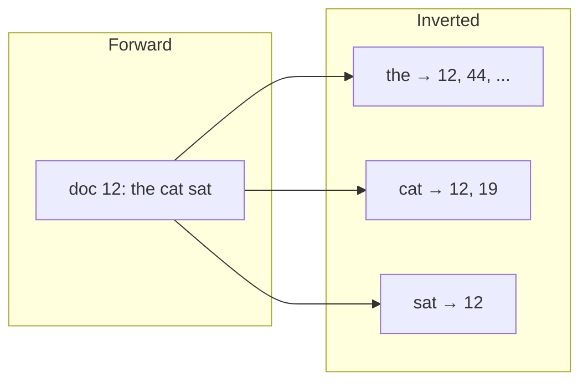
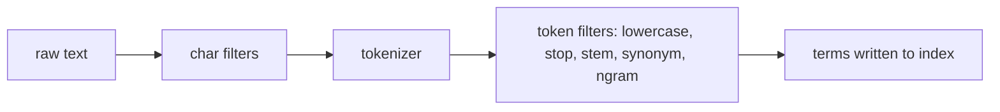
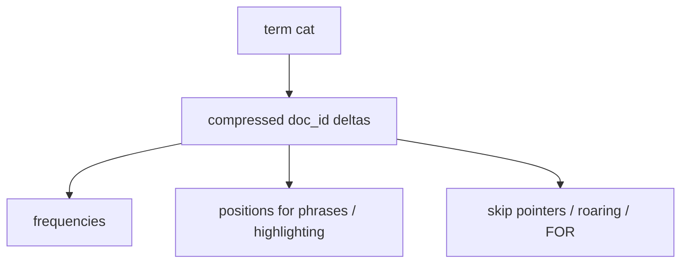
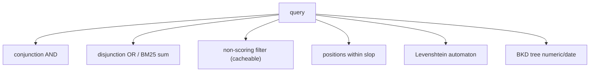
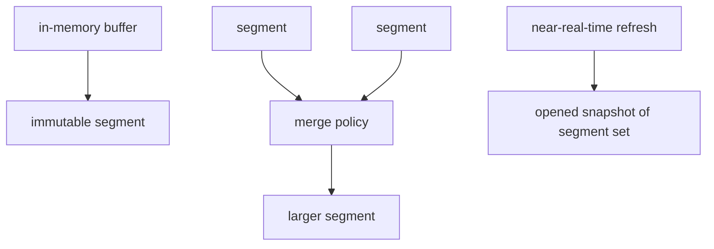
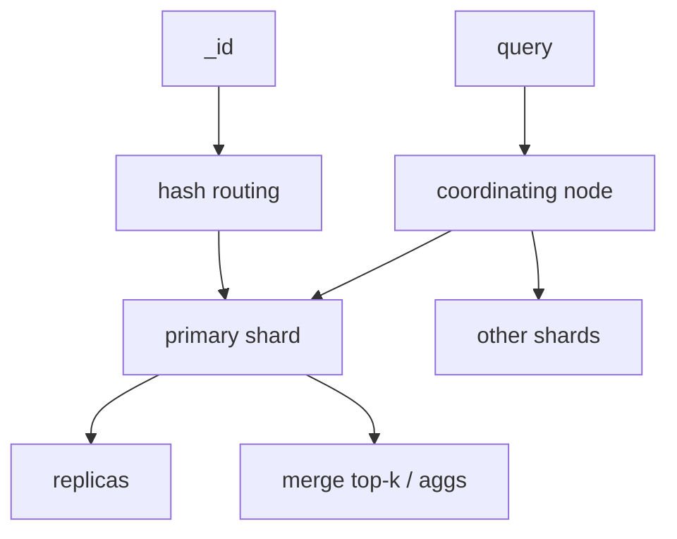
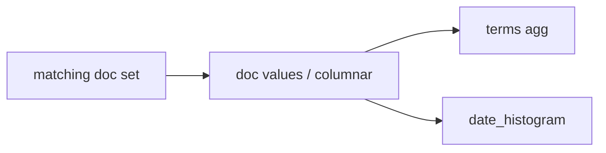

# 05 — Search Engines and Inverted Indexes

Elasticsearch, OpenSearch, Solr, Lucene, Vespa (lexical part), Mongo Atlas Search, Postgres `tsvector`. The core structure is the **inverted index**: term → postings.

---

## 1. Forward vs inverted



**Forward index** (stored fields / `_source` / doc values): reconstruct the document, aggregations, highlighting.

**Inverted index:** find candidate docs. Ranking uses TF, DF, field length, positions, payloads.

---

## 2. Analysis chain (the real product)



Index-time analysis **must match** query-time analysis (or use `search_analyzer` deliberately).

| Technique | Effect |
|-----------|--------|
| Keyword / `keyword` field | Exact match, aggregations, sorts |
| Standard tokenizer | Words |
| N-gram / edge n-gram | Autocomplete, substrings |
| Shingle | Phrase-ish features |
| Stemming | recall↑ precision↓ |
| Synonyms | graph queries / expansion |
| ICU / language analyzers | multilingual |

**Doc values:** columnar copy of fields for `SORT` / `AGG`. Separate from inverted index. This is why ES can facet millions of docs without loading `_source`.

---

## 3. Posting lists

A posting is typically `(doc_id, freq, positions[])`.



**Compression:** delta-encoded doc ids, variable-byte, PForDelta, roaring bitmaps (especially filters / BKD).

**Skip lists / impacts:** skip to the next doc ≥ target during boolean AND (DAAT — document-at-a-time).

**WAND / MaxScore / Block-Max WAND:** skip docs that cannot enter top-k given upper bounds on remaining scores — essential for web-scale BM25.

---

## 4. Boolean retrieval and query types



| Query | Index used |
|-------|------------|
| `term` / `match` | Inverted |
| `match_phrase` | Inverted + positions |
| `filter` / `bool.filter` | Inverted or BKD; **cached bitsets** |
| `range` on number/date | **BKD** (Lucene 6+) not classic terms |
| `prefix` / `wildcard` | Term dictionary automaton; leading wildcard = pain |
| `fuzzy` | Levenshtein + term dict |
| `geo` | LatLon BKD / geohash prefixes |

**Filter vs query:** filters skip scoring and populate the **filter cache** (bitset per clause). Huge win for `tenant_id:42`.

---

## 5. Ranking: TF-IDF → BM25 → learning-to-rank

**BM25** (default in Lucene): saturating term frequency, document length normalization, IDF.

```text
score(d,q) = Σ IDF(t) * tf'(t,d) * boosts * field norms
```

Beyond BM25:

- **BM25F** / field boosts (title > body).
- **Function score** (recency, popularity).
- **LTR** (LambdaMART): rerank top-k with features (clicks, PageRank, embeddings).
- **SPL ADE / learned sparse:** model outputs weighted terms into the **same inverted index**.

Sparse neural retrieval still uses this note’s structures; dense retrieval is [06-vector-rag.md](./06-vector-rag.md).

---

## 6. Lucene segments = LSM for search



- **Refresh:** make new segment searchable (ES default 1s) — visibility lag.
- **Flush / commit:** fsync, translog.
- **Merge:** like compaction; deleted docs are tombstones until merge.
- **Force merge:** fewer segments, faster search, expensive; common on read-only time indexes.

Deletes: bit of deleted docs; postings still contain them until merge. **Update = delete + insert.**

---

## 7. Sharding and routing



- Each shard is a **full Lucene index**.
- Query is **scatter-gather**; relevance is merged (with caveats for DFS query-then-fetch vs query-then-fetch IDF).
- **Custom routing** (`tenant_id`) keeps a tenant on one shard → cheaper filters, hot-tenant risk.
- Too many shards: cluster-state and heap death (“shard explosion”).

---

## 8. Aggregations, facets, and why doc values exist



Inverted index is the wrong layout for `GROUP BY`. Doc values (or star-tree / precomputed in OpenSearch) are the aggregation index.

---

## 9. Highlighting and positions

Phrase queries and highlighters need **offsets/positions** or re-analysis of stored `_source` (slower, less accurate). Indexing offsets costs space.

---

## 10. Postgres FTS vs Lucene

| | `tsvector` + GIN | Lucene |
|--|------------------|--------|
| Ranking | `ts_rank`, limited | BM25, LTR, field norms |
| Scale-out | You build it | Native shards |
| Txional | Same MVCC as rows | Eventual / refresh |
| Analyzers | dictionaries, less ecosystem | huge |

Use Postgres FTS for **light** search with strong consistency. Use ES when search **is** the product.

**pg_trgm GIN:** substring / similarity without a search cluster.

---

## 11. Index-time vs query-time trade-offs

| Index-time | Query-time |
|------------|------------|
| Synonym expansion (bigger index) | Synonym graph (slower query) |
| N-grams (autocomplete always on) | Completion suggester FST |
| Denormalize nested objects | Nested / join queries (slow) |

**Nested / parent-child** in ES: separate inverted indexes with join pointers — expensive; prefer denormalization.

---

## 12. Operational metrics that are index metrics

- Segment count, merge backpressure
- Refresh lag
- Filter cache hit rate
- Fielddata vs doc values (heap)
- Query latency p99 vs indexing rate (shared IO)

---

## 13. Checklist

1. Map fields: `keyword` vs `text` vs numeric BKD vs geo.
2. Put **filters** in `filter` context (`tenant`, `type`, `status`).
3. Don’t score what you can filter.
4. Design `_id` / routing for locality.
5. Treat mapping changes as schema migrations (reindex).
6. For RAG lexical channel, reuse this stack (BM25) beside vectors.
