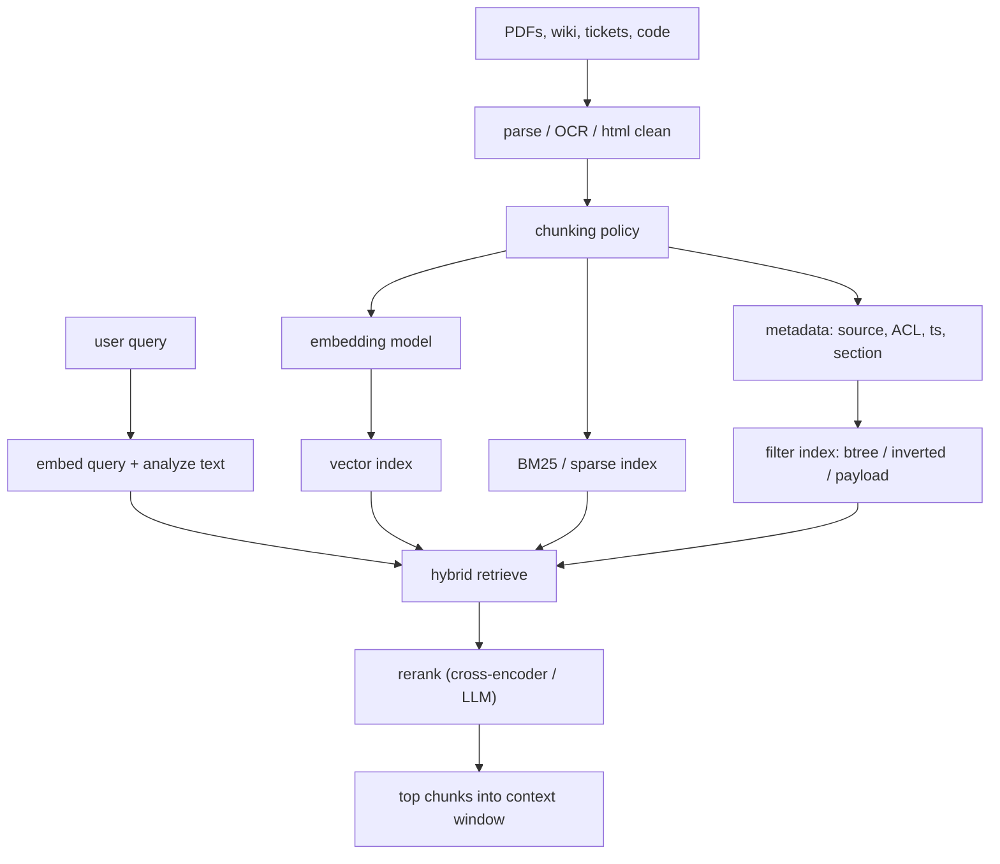
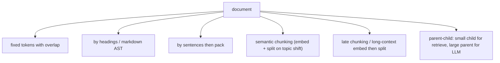
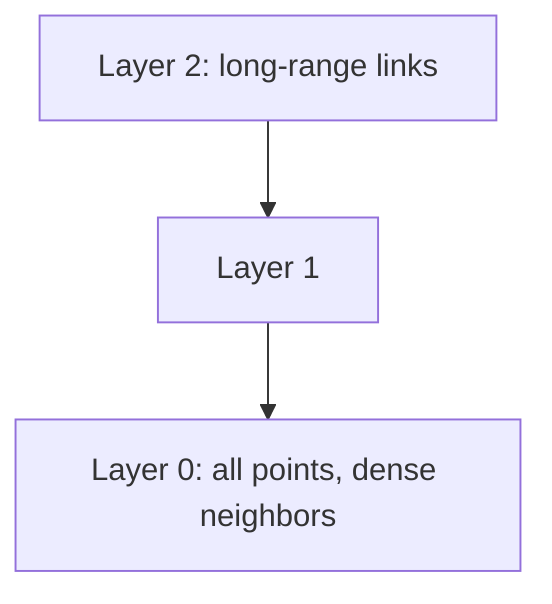
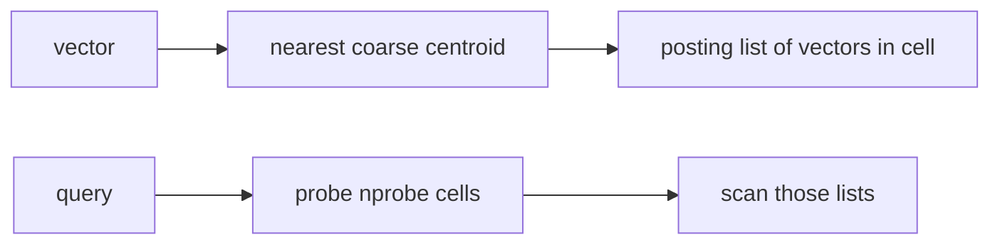
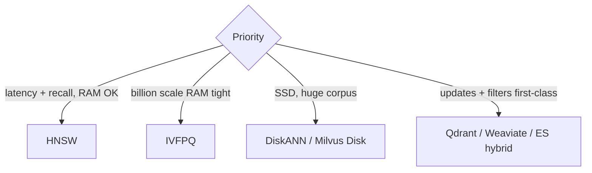
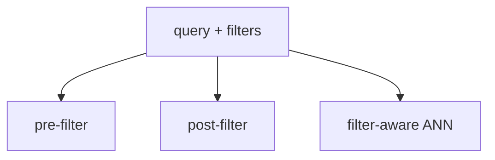
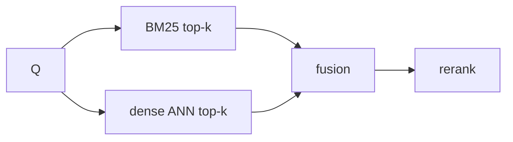
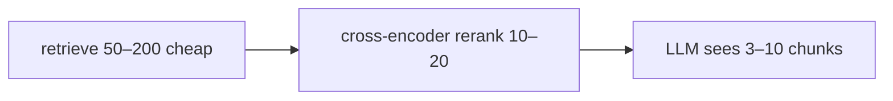
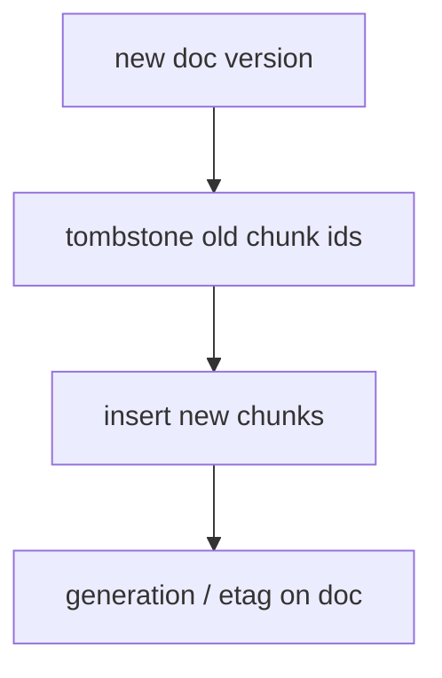
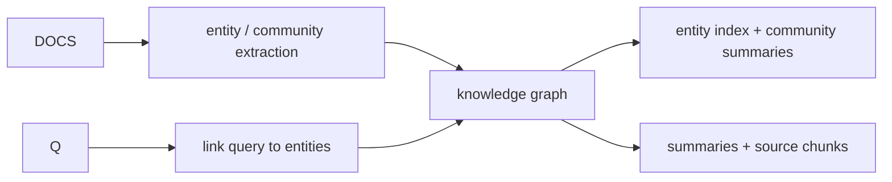

# 06 — Vector Indexes and Document RAG

RAG (Retrieval-Augmented Generation) is not “one vector DB.” It is a **pipeline**: chunk → embed → index → retrieve → (optional rerank) → pack into the prompt. Indexing strategy is usually **hybrid**: dense ANN + sparse BM25 + metadata filters.

Related: chat stack RAG diagram in `concepts/ai/ai-system-design/ChatInterface/05-prompt-context-assembly.md`.

---

## 1. End-to-end index lifecycle



**Chunk IDs must be stable** for citations, updates, and deletes. Typical key: `(doc_id, chunk_ix, hash)` or content-addressed `(doc_id, start, end)`.

---

## 2. What you are indexing (not just embeddings)

| Artifact | Why |
|----------|-----|
| Embedding vector | Semantic ANN |
| Raw chunk text | BM25, highlighting, LLM context |
| Parent document / section | Parent-child retrieval |
| Metadata | ACL, tenant, recency, type filters |
| Sparse vector / term weights | SPLADE / BM25 in same engine |
| Graph edges | GraphRAG, citations, entity links |

A vector-only index **without** payload/metadata forces a second hop to object storage and cannot enforce ACLs at retrieve time.

---

## 3. Chunking strategies (they dominate recall)



| Strategy | Strength | Failure mode |
|----------|----------|--------------|
| Fixed + overlap | Simple | Splits tables, code, arguments |
| Structure-aware | Keeps sections | Bad HTML/PDF structure |
| Semantic | Better topical chunks | Slow ingest, unstable splits |
| Parent-child | Precise retrieve, fat context | Two indexes or two queries |
| Small-to-big | Retrieve sentence, expand window | Expansion can exceed budget |

**Overlap** exists so a fact on a boundary isn’t missing from both chunks. Typical 10–20% overlap.

**Code RAG:** chunk by AST (function/class), not tokens. Index `(repo, path, symbol)` metadata.

---

## 4. Dense vector indexes (ANN)

Exact kNN (`O(n)` scan) works to ~10⁵–10⁶ with care. Production corpora use **Approximate Nearest Neighbor**.

### 4.1 HNSW (Hierarchical Navigable Small World)



- Greedy search from a enter point, descend layers.
- **High recall**, good latency, **high RAM** (graph + vectors).
- Inserts OK; **deletes** are awkward (tombstones, periodic rebuild).
- Used by: pgvector, Milvus, Weaviate, Qdrant, Elasticsearch `hnsw`, Chroma, FAISS HNSW.

Knobs: `M` (degree), `efConstruction`, `efSearch`. Higher → recall and RAM/latency.

### 4.2 IVF (inverted file of centroids)



- Train k-means on a sample.
- **IVF-Flat:** store full vectors in lists.
- **IVF-PQ:** store product-quantized codes (see below).
- Low RAM vs HNSW; recall depends on `nprobe`. Bad if data distribution shifts (need retrain).

### 4.3 Product quantization (PQ) / OPQ / RQ

Split vector into `m` subvectors, codebook per subspace, store **bytes** not floats.

```text
768-d float32 ≈ 3KB  →  PQ m=16, 8-bit ≈ 16 bytes
```

Enables billion-scale in RAM/SSD. Distance is **approximate**. Often combined with IVF or HNSW (HNSW on quantized codes).

### 4.4 DiskANN / Vamana / SPANN

Graph or clustering laid out for **SSD**: search is a small number of random I/Os, vectors live on disk. Used when RAM cannot hold HNSW.

### 4.5 LSH / Annoy / ScaNN / NSFW

| Family | Idea |
|--------|------|
| **LSH** | Hash so nearby points collide; theoretically clean, often weaker recall/throughput than HNSW/IVF today |
| **Annoy** | Forest of random projection trees; simple, static |
| **ScaNN** | Google: anisotropic quantization + score-aware |
| **NSG / NSG+** | Other graph indexes |

### 4.6 Comparison snapshot



**Recall@k** is the index SLO. Always measure with **your** embeddings and **filtered** queries (filters change the effective graph).

---

## 5. Metadata filtering (the production footgun)

Queries are almost never “top-10 in the universe.” They are “top-10 **this tenant, this ACL, last 90 days**.”



| Strategy | Behavior |
|----------|----------|
| **Post-filter** | ANN then drop non-matching. If 99% filtered out, you retrieve garbage or empty. |
| **Pre-filter** | Restrict candidate ids (bitmap / inverted metadata) then ANN or brute force on the subset. |
| **Payload-aware HNSW** | Search ignores edges that fail filter (Qdrant-style); still can degrade if filter is extremely selective. |
| **Partition indexes** | One HNSW per tenant — great isolation, operational explosion. |
| **Filtered IVF** | Skip lists that don’t match; need metadata attached to lists. |

**ACL:** retrieve only chunks the user may see. Enforce in the index (filter) **and** re-check at pack time (TOCTOU / stale ACL).

---

## 6. Sparse + dense hybrid



**Fusion:**

- **RRF (Reciprocal Rank Fusion):** `score = Σ 1/(k + rank_i)` — no score calibration.
- Weighted sum after min-max / z-score (fragile across query types).
- **SPLADE** / BGE-M3 sparse: learned terms in Lucene; hybrid inside one engine (ES, Vespa).

Lexical wins on **IDs, error codes, rare names**. Dense wins on paraphrase. Hybrid is the default for document RAG.

---

## 7. Reranking and multi-stage retrieval



Cross-encoders (query+doc together) are too slow for the whole corpus; they **are** an index-time vs query-time trade-off: you index cheap features, spend GPU on a shortlist.

**ColBERT / late interaction:** store token-level embeddings; MaxSim at query time. Higher quality, heavier index (token vectors). RAGatouille / Vespa patterns.

---

## 8. Index updates, versioning, and deletes



- HNSW deletes: mark deleted; search skips; **rebuild** when deleted fraction is high.
- IVF: remove from list; centroids stale after distribution shift.
- Prefer **immutable chunks + generation**: queries filter `gen = current`.
- Re-embed when **the embedding model changes** (full reindex). Store `model_id` in metadata.

**Incremental PDF:** don’t re-embed unchanged pages (content hash).

---

## 9. Where the index lives (product choices)

| Store | Indexing notes |
|-------|----------------|
| **pgvector** | B-tree/GiST/HNSW/IVF inside Postgres; same TX as rows; scale is a single-node/replica story unless you shard |
| **ES / OpenSearch** | kNN HNSW + BM25 + filters in one query DSL |
| **Qdrant / Weaviate / Milvus / Pinecone / Chroma** | Purpose-built ANN + payloads |
| **FAISS / Annoy files** | Library, you own serving, sharding, filters |
| **Vespa** | Strong hybrid, ranking framework |
| **SQLite VSS / LanceDB / DuckDB VSS** | Local / analytics-flavored RAG |

There is no free **join** between “vectors in Pinecone” and “ACLs in Postgres” — you duplicate metadata or query two systems.

---

## 10. GraphRAG and non-vector indexes in RAG



You still keep a **chunk vector index** for local Q&A; the graph is a second index for global questions (“themes in the corpus”).

Other RAG indexes:

- **Hypothetical document embeddings (HyDE):** embed an LLM-generated answer, search with that vector.
- **Query expansion / multi-query:** several embeddings fused.
- **Time-decay** as a ranking feature, not a separate ANN.

---

## 11. Evaluation is part of indexing

You cannot tune `efSearch` / chunk size without:

- A labeled set: `(query, relevant chunk ids)`
- Metrics: Recall@k, MRR, nDCG, **answer faithfulness** (separate)
- Slices: filtered vs unfiltered, long vs short queries

Index parameters that look “faster” often **drop recall on filtered queries first**.

---

## 12. Cost model

| Cost | Driver |
|------|--------|
| Ingest $ | embedding tokens + parse |
| RAM | HNSW graph + full precision vectors |
| Disk | PQ codes, replicas, BM25 |
| Query $ | embed query + ANN + rerank GPU |
| Stale answers | refresh lag, wrong chunk boundaries, ACL bugs |

---

## 13. Checklist

1. Fix chunking and IDs before shopping vector DBs.
2. Always plan **hybrid + metadata/ACL filters**.
3. Measure Recall@k under the real filter selectivity.
4. Version embeddings; make reindex a button, not a surprise.
5. Rerank a shortlist; don’t dump 50 chunks into the LLM.
6. Parent-child or small-to-big before jumping to GraphRAG.
