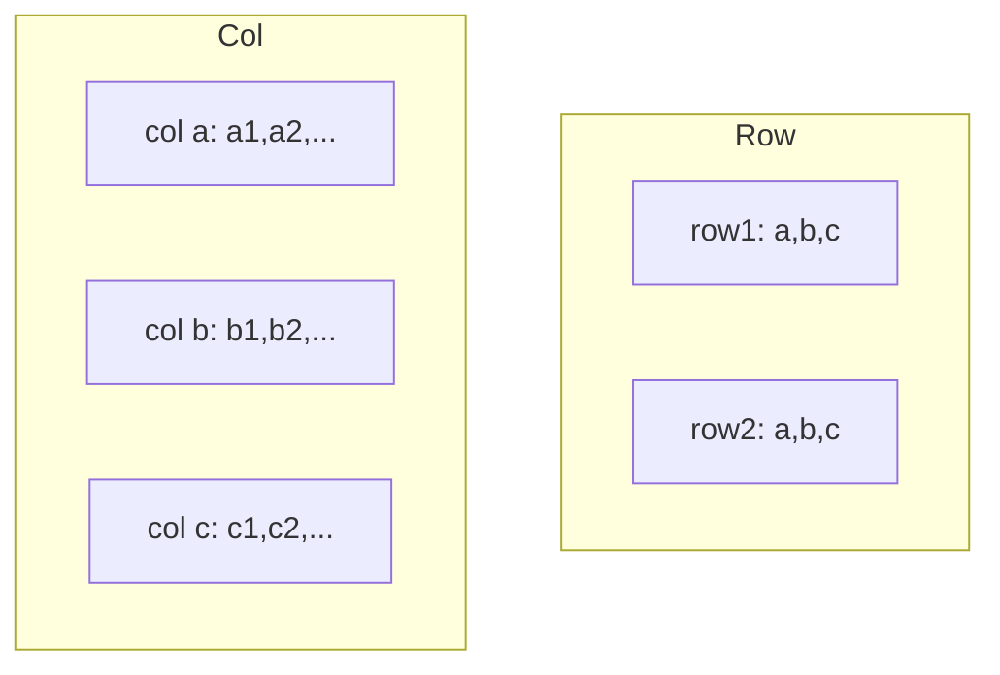
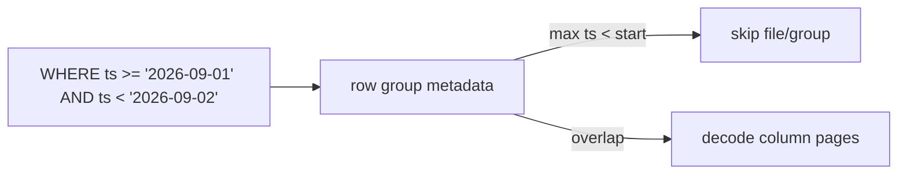
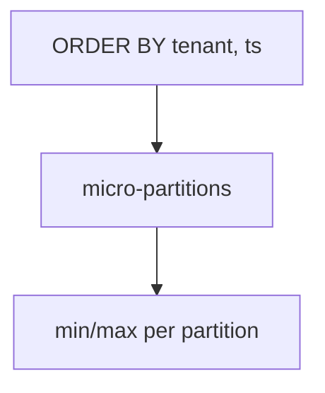
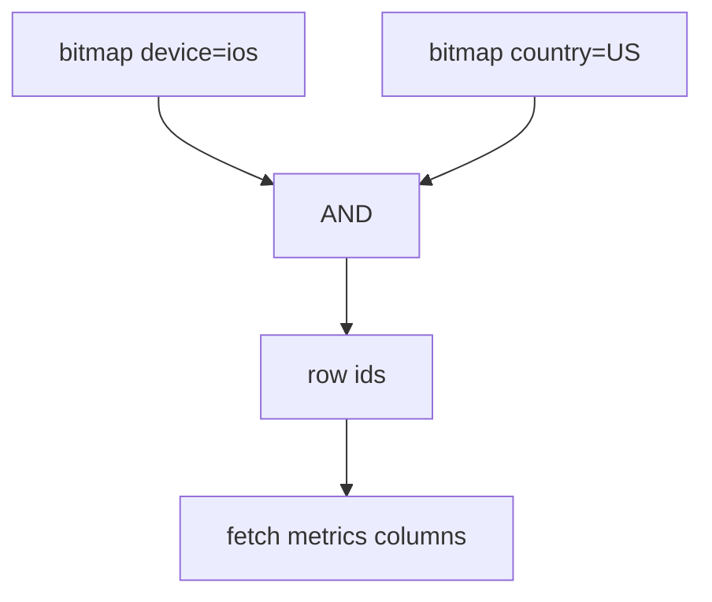
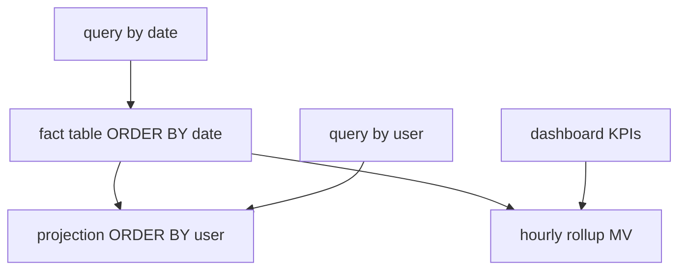
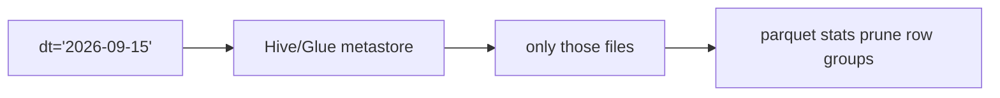

# 07 — Columnar and OLAP Indexes

ClickHouse, DuckDB, BigQuery, Snowflake, Redshift, Spark/Parquet, Druid, Pinot. The winning move is **not reading the data**. Indexes here are **skipping, bitmaps, and projections**, not OLTP B-trees on every column.

---

## 1. Columnar layout



Aggregations (`SUM`, `GROUP BY`) read **one column** (plus grouping keys). Compression (RLE, dictionary, delta) is excellent on sorted/low-cardinality columns.

**Row groups / granules / stripes:** 50k–1M rows. Each has **min/max / dictionary** — the primary index.

---

## 2. Zone maps / min-max / skip indexes



Works only if **physical order correlates** with the filter column. That is why OLAP tables are **sorted / clustered / PARTITION BY** time or a frequent dimension.

| System | Name |
|--------|------|
| Parquet | row-group statistics, page index (ColumnIndex) |
| ClickHouse | primary key sparse index + granules; data skipping indexes |
| Snowflake | micro-partition metadata (automatic) |
| BigQuery | optional clustering; storage metadata |
| Postgres BRIN | same idea on heap pages |
| Spark | file-level + parquet stats |



**Clustering depth:** `(date, user_id)` helps both time windows and per-user scans if date is first.

---

## 3. Sparse primary indexes (ClickHouse-style)

ClickHouse `ORDER BY (user_id, ts)` stores a **sparse** index: every Nth granule’s key.

```text
granule 0: (user=1, ts=...)
granule 1: (user=1, ts=...)
...
granule k: (user=9, ts=...)
```

A lookup finds a **range of granules**, then scans them. Not a B-tree point lookup of one row.

**Primary key ≠ uniqueness.** It’s a sort key.

---

## 4. Secondary skip indexes (ClickHouse, etc.)

| Type | Use |
|------|-----|
| **minmax** | numeric/date extra columns not in ORDER BY |
| **set** | small-cardinality `IN` |
| **bloom_filter** | high-cardinality equality (`user_id` not in PK) |
| **ngrambf / tokenbf** | `LIKE` / token membership |
| **inverted** (newer CH) | text-ish |


False positives cost extra granule reads; false negatives are forbidden.

---

## 5. Bitmap indexes (warehouse classic)

```text
country=US  roaring bitmap of row numbers
country=IN  ...
```

AND/OR for star-schema filters (`WHERE country AND device AND campaign`).

- **Druid / Pinot:** inverted indexes + bitmaps on dimensions; excellent for slice-and-dice dashboards.
- **Oracle bitmap:** see OLTP warning — OLAP load is batch, so bitmaps shine.
- **Roaring bitmaps:** compressed, fast intersections.



---

## 6. Projections, materialized views, and summary indexes

When skip indexes aren’t enough, **store another physical layout**.



| Pattern | Systems |
|---------|---------|
| Projection | ClickHouse, DuckDB |
| Clustered + automatic clustering | Snowflake, BigQuery |
| Materialized view | all warehouses; Druid rollup at ingest |
| Cube / star-tree | ES/OpenSearch, Druid |

**Ingest-time rollup:** lose raw grain, tiny indexes, instant dashboards. Irreversible without raw sidecar.

---

## 7. Partitioning and pruning (Hive / Spark / BigQuery)

```text
s3://bucket/dt=2026-09-15/country=US/part-000.parquet
```



**Anti-pattern:** thousands of tiny partitions (Hive small-files problem). **Anti-pattern:** partition on high-cardinality `user_id` (millions of dirs).

---

## 8. Join indexes / data skipping on joins

Warehouses prefer **broadcast / shuffle joins** over nested-loop index joins.

Still:

- **Join clustering** / collocation (Snowflake search optimization, BigQuery clustering both tables on join key).
- **Z-order / Hilbert** (Databricks, some lakehouses): interleave multiple dimensions so min/max skipping works for several columns at once.


---

## 9. Search optimization / bloom at warehouse scale

Snowflake **search optimization service**, BigQuery **search indexes**, Redshift **interleaved sort keys** — bloom-like or inverted structures on **selective point lookups** into huge fact tables (semi-structured, IDs).

These exist because zone maps fail on **random high-cardinality** IDs.

---

## 10. Time-series OLAP overlap

ClickHouse / Pinot / Druid ingest ordered by time → skip indexes + TTL drop of old partitions. See also [09-timeseries-spatial.md](./09-timeseries-spatial.md).

**Dictionary encoding** of tags (`host`, `pod`) is both compression and a de facto index.

---

## 11. When NOT to use OLAP indexes

- Point `UPDATE` of one row 10k times/sec → OLTP B-tree.
- Need `SELECT *` of random rows by PK → columnar is the wrong layout (wide rows reconstruct many columns).
- High-cardinality bitmap on `user_id` with millions of users — bitmaps explode; use skip/bloom or a dedicated KV.

---

## 12. Checklist

1. **Sort/cluster** by the most common filter (usually time, then tenant).
2. Partition coarsely (day/month), not per id.
3. Add skip/bloom only for filters that still read too many granules.
4. Use projections/MVs for a second access path instead of a second OLTP-style B-tree on every column.
5. Keep files large enough for stats to matter (compaction).
