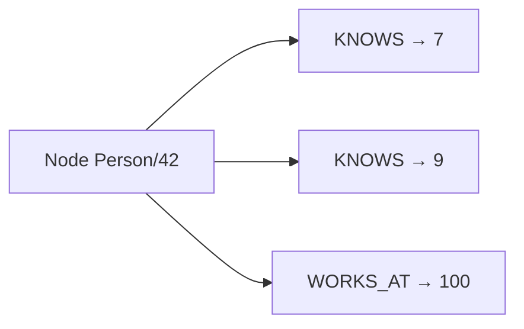
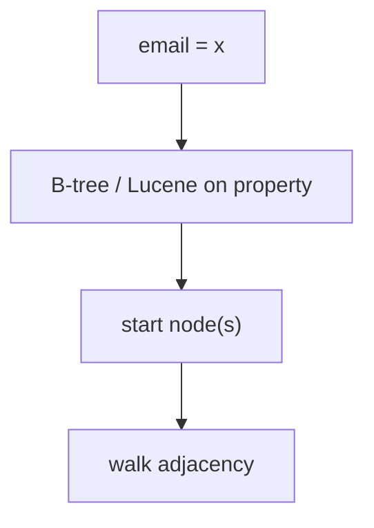
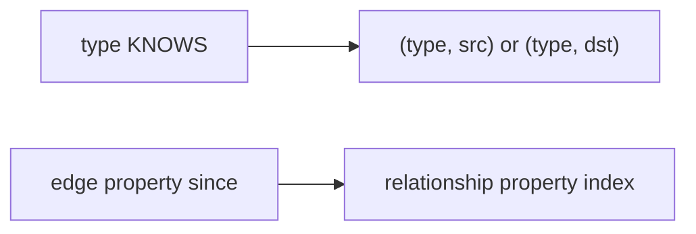
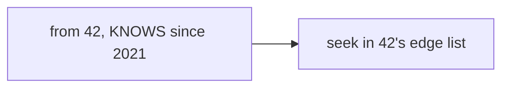
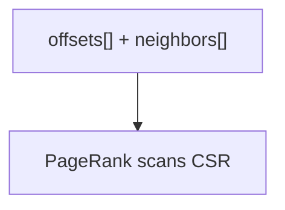
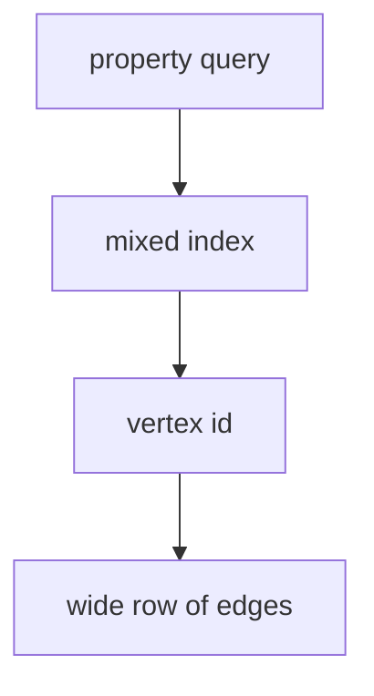
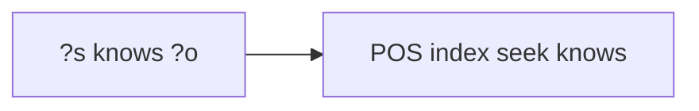

# 08 — Graph Database Indexes

Neo4j, Neptune, JanusGraph, TigerGraph, DGraph, Memgraph, AWS Neptune, and “graph on relational.” Traversal performance comes from **adjacency locality**, not from joining indexed edge tables blindly.

---

## 1. The real index: adjacency



**Index-free adjacency:** each node stores direct pointers (or offsets) to neighbors. `O(degree)` to expand, independent of `|E|`.

Relational equivalent without care:

```sql
SELECT * FROM edges WHERE src = 42;  -- B-tree on src: OK
-- then repeat for each neighbor: OK if indexes exist
-- 3-hop over high-degree nodes: many index seeks + joins
```

Graphs win when **multi-hop** and **variable-length** paths are the query.

---

## 2. Property indexes (the “SQL-like” ones)

You still need to **find the start node**.

```cypher
CREATE INDEX FOR (p:Person) ON (p.email);
MATCH (p:Person {email: $e})-[:KNOWS*1..3]->(f) RETURN f;
```



| Index | Role |
|-------|------|
| Label + property uniqueness | Constraints (`email` unique) |
| Composite property | `(tenant, slug)` |
| Full-text (Lucene in Neo4j) | Fuzzy start-node search |
| Range on property | `created_at` filters **during** or **after** expansion |

**Planner:** pick selective start set, then expand. Bad: `MATCH (n) WHERE n.age > 18` then expand the whole graph.

---

## 3. Relationship / edge indexes



- Filter `[:KNOWS {since: 2020}]` without scanning all `KNOWS` from a supernode.
- Neptune / JanusGraph: mixed index backends (Elasticsearch, Solr, Cassandra) for properties; adjacency in the graph store.

**Supernodes** (celebrities, `http` nodes): even adjacency lists are huge. Mitigations: edge partitioning, vertex-centric indexes with sort keys (`timestamp`), skip high-degree, bidirectional constraints.

---

## 4. Vertex-centric indexes (Titan / JanusGraph idea)

For a single vertex, edges stored **sorted by (label, property, other-id)**.

```text
Node 42:
  KNOWS | ts=2020 | 7
  KNOWS | ts=2021 | 9
  LIKES | ts=2021 | 15
```



This is the graph analog of Cassandra clustering columns. Critical for time-ordered “last 50 follows.”

---

## 5. Path, reachability, and specialized structures

| Structure | Problem |
|-----------|---------|
| BFS/DFS + visited set | Shortest path unweighted |
| Bidirectional BFS | Faster s–t |
| Landmark / 2-hop labels / PLIT | Reachability on huge DAGs |
| Contraction hierarchies / hub labels | Road networks |
| CSR / CSC compressed sparse row | Analytics (Pagerank) in memory |
| GraphBLAS / adjacency matrix | Batch linear-algebra graph |

OLTP graph DBs rarely store CH by default; analytics engines (GraphX, Pregel) use **CSR** as the index.



---

## 6. Graph on KV / wide-column

JanusGraph: `adjacency` in Cassandra/HBase (row = vertex id, columns = edges). Secondary property indexes in ES.



You inherit LSM issues: hot vertex = hot partition.

---

## 7. RDF / triple stores

Indexes on permutations of `(S,P,O)`:

```text
SPO, POS, OSP  (and sometimes more)
```



SPARQL planners pick the permutation. Hexastore = all 6 permutations — space for query flexibility.

---

## 8. GraphRAG indexing (overlap with vectors)

See [06-vector-rag.md](./06-vector-rag.md). Graph side:

- Entity nodes with **vector** on name/description for linking
- Community detection → **summary documents** in the vector index
- Edges as citation/next-chunk for expansion after dense retrieve

---

## 9. Anti-patterns

1. Using Neo4j as a document store with one property index and no traversals.
2. Unbounded `* ` variable-length match without `WHERE` / `LIMIT`.
3. No uniqueness constraints → duplicate start nodes, cartesian explosions.
4. Indexing every property “just in case” (write cost, same as OLTP).
5. Ignoring supernodes in social/network models.

---

## 10. Checklist

1. Constraints + start-node property indexes.
2. Model relationships to bound degree or add vertex-centric sort keys.
3. Full-text only to **find starts**, then traverse.
4. For global analytics, export CSR; don’t run Pagerank as millions of OLTP hops.
5. For RAG, keep graph and chunk indexes explicitly synced (doc version).
