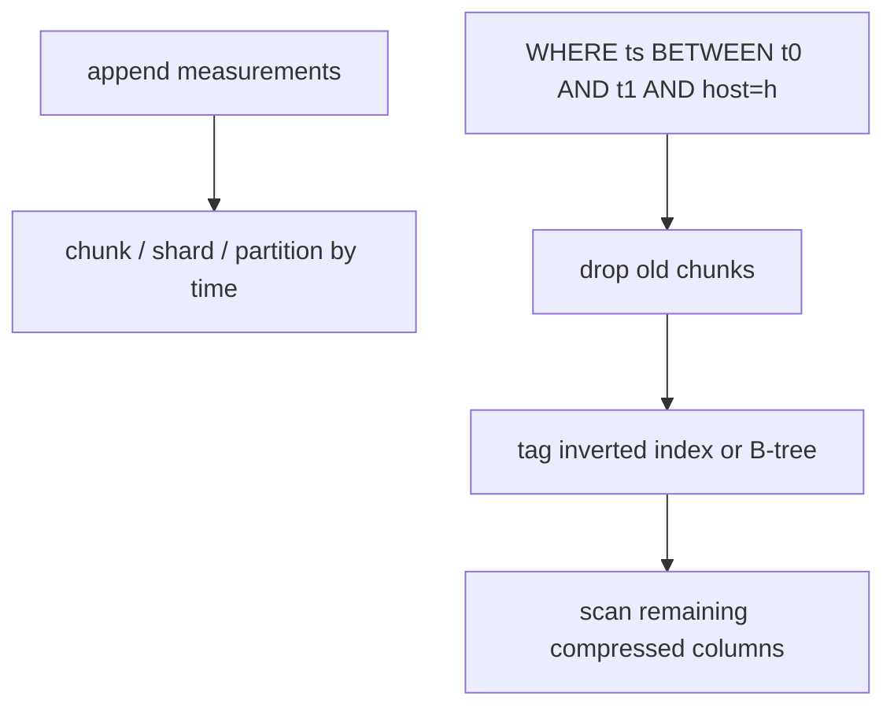
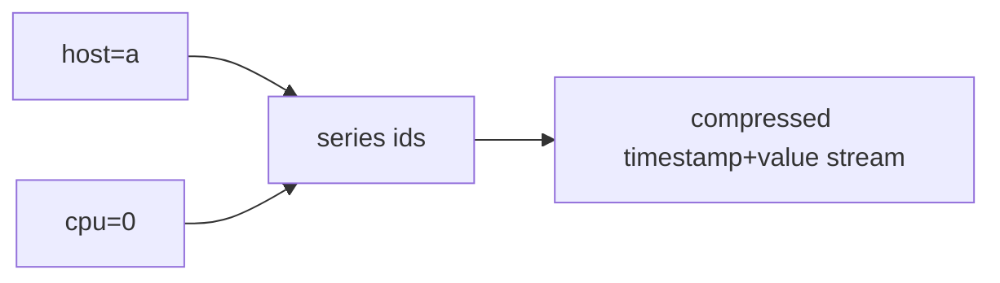
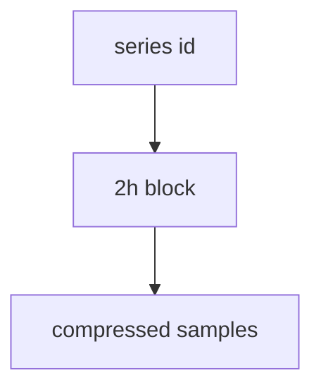
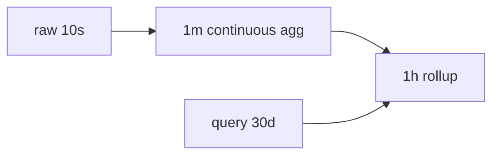
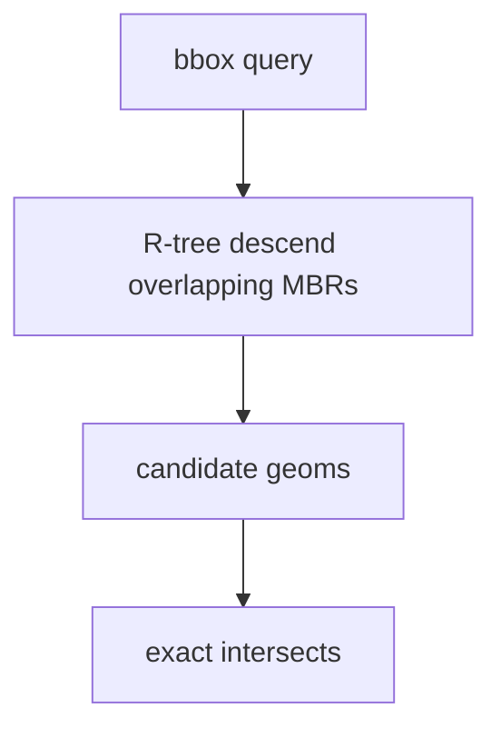
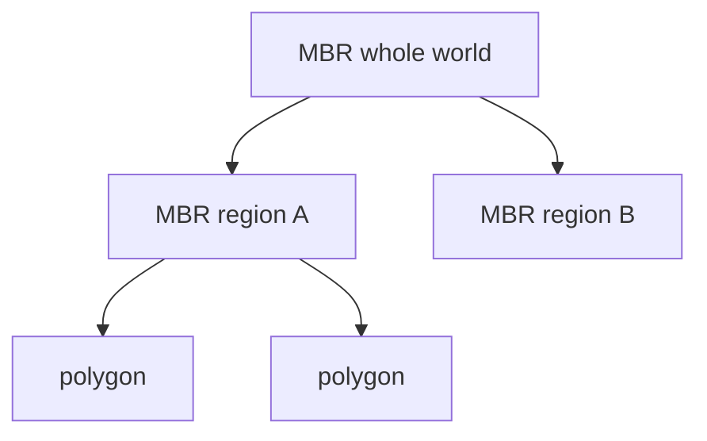
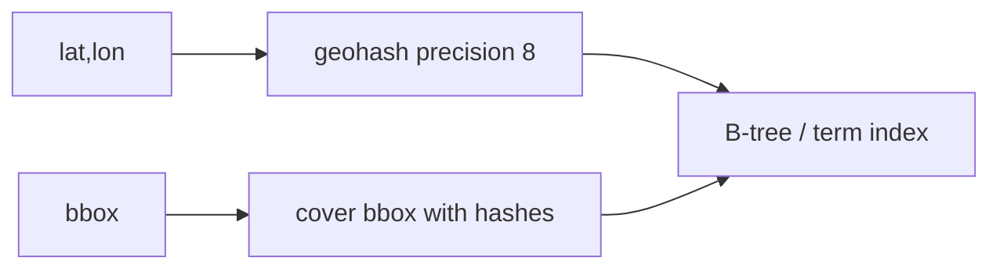
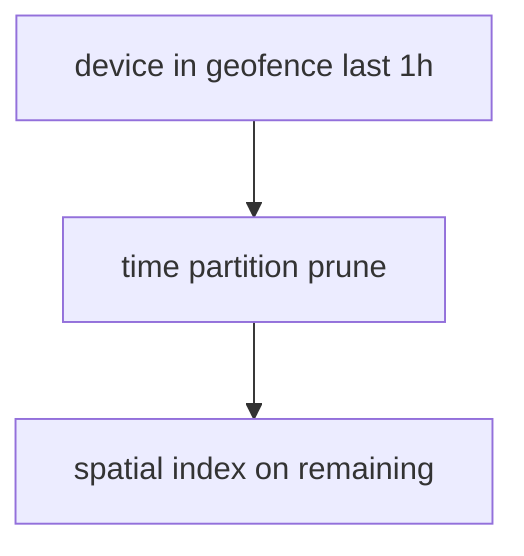

# 09 — Time-Series and Spatial Indexes

InfluxDB, TimescaleDB, Prometheus, QuestDB, IoT stores, PostGIS, Mongo 2dsphere, Elasticsearch geo. Two dimensions dominate: **time** (almost always sequential ingest) and **space** (2D/3D, not a total order).

---

## 1. Time-series: partitioning is the index

| System | Time index |
|--------|------------|
| TimescaleDB | hypertables (chunked B-trees / BRIN-like) |
| InfluxDB TSM | time-structured merge (LSM specialized for time) |
| Prometheus TSDB | 2h blocks, XOR samples, inverted label index |
| ClickHouse | `ORDER BY (metric, ts)` + partition by month |
| QuestDB | designated timestamp, time partitions |

**Hot chunk** (current time) stays in RAM/cache. Queries for “last 15 min” never touch deep history.

---

## 2. Tag / series indexes

A “series” = metric + label set (`cpu{host=a,cpu=0}`).

Prometheus: **inverted index on labels** (postings of series ids), then range-scan samples. High-cardinality labels (`user_id` on a metric) explode the series index — the classic TSDB failure mode.

Influx: tag keys indexed; fields not (typically). Same cardinality warning.

---

## 3. Compression as a partner of indexing

XOR (Gorilla), delta-of-delta timestamps, dictionary tags. You index **series ids**, not every sample. Sample fetch is sequential inside a block — B-tree per sample would be insane.

---

## 4. Out-of-order writes and late data

LSM/TSM and Timescale chunks assume **mostly append**. Out-of-order:

- Flush to a different structure / WAL
- Compact later
- Query must merge ordered streams

**Backfill** can shatter BRIN/zone-map correlation if you scatter old timestamps into new pages. Prefer writing into the correct historical partition.

---

## 5. Downsampling indexes

Materialized continuous aggregates (Timescale, Influx tasks, Prom recording rules) are **precomputed indexes** for wide time ranges.

Retention: drop raw, keep rollups — storage index policy as product policy.

---

## 6. Spatial: why B-trees struggle

B-trees need a **total order**. Space is 2D. Mapping tricks:

| Trick | Idea | Failure |
|-------|------|---------|
| **Geohash / S2 / H3 string** | 1D prefix; B-tree `LIKE 'u4pru%'` | Cells that cross query rectangle; false positives |
| **Z-order / Hilbert** | Interleave bits of x,y | Same: bounding box ≠ interval |
| **R-tree / GiST** | Hierarchical bounding rectangles | Updates, overlap |
| **BKD / k-d tree** | Recursively split dimensions (Lucene geo) | Build cost |
| **Grid** | Fixed cells | Uneven density |

Always **filter-then-refine**: index returns candidates; exact geometry is CPU.

---

## 7. R-trees and GiST (PostGIS)

- **GiST** in Postgres is the framework; `GIST(geom)` typical for PostGIS.
- **SP-GiST** quadtrees for some point data.
- **BRIN** on `geom` only if physically clustered (rare except space-filling ingest).

KNN: `<->` distance with GiST index (nearest bars to a point).

---

## 8. Geohash / S2 as B-tree keys (Mongo, ES, Dynamo)

**Covering:** a rectangle becomes many prefix ranges. Precision vs number of cells is a knob.

**Geo-distance sort:** still need haversine on candidates; index only prunes.

---

## 9. Combined time + space (trajectories, IoT)

Patterns:

- Partition by time, R-tree inside chunk (Timescale + PostGIS).
- Composite: `geohash + ts` as clustering key (Cassandra).
- 3D R-tree (x,y,t) — harder, more overlap.

**Trajectory:** index segments not points (too many). Simplify lines, index MBRs of segments.

---

## 10. Multi-dimensional OLAP overlap

Databricks Z-ORDER, ClickHouse `ORDER BY (toDate(ts), geohash)` — same “make min/max tight on several dimensions.” See [07-columnar-olap.md](./07-columnar-olap.md).

---

## 11. Anti-patterns

1. High-cardinality tags on metrics (`request_id` as a label).
2. One R-tree for the entire 10-year trajectory table without time prune.
3. Storing geohash at one precision only — too coarse (huge cells) or too fine (huge keys).
4. `WHERE ST_Distance(geom, p) < r` without `<->` / `ST_DWithin` indexable form.
5. Random UUID partition keys in a TSDB (destroys time locality).

---

## 12. Checklist

1. Time partition / chunk first; never full-scan history for “last hour.”
2. Bound series/tag cardinality.
3. Spatial: GiST/R-tree or S2 covering + refine; always combine with time.
4. Downsample for wide-range charts.
5. Keep ingest mostly in-order for skip indexes / TSM efficiency.
