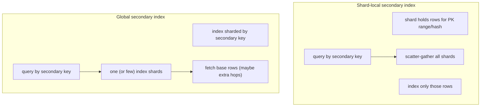
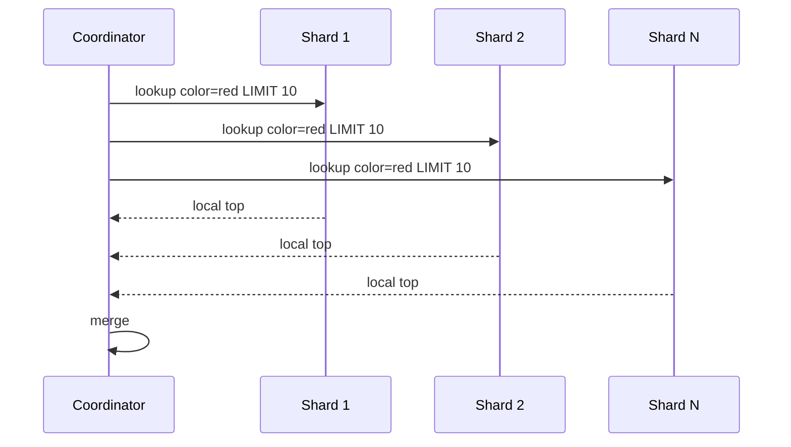
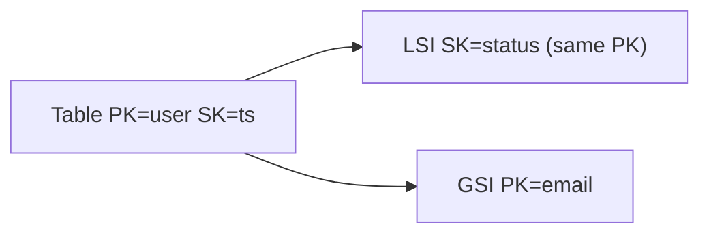
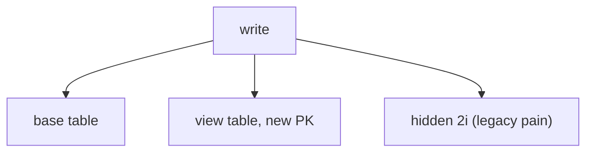
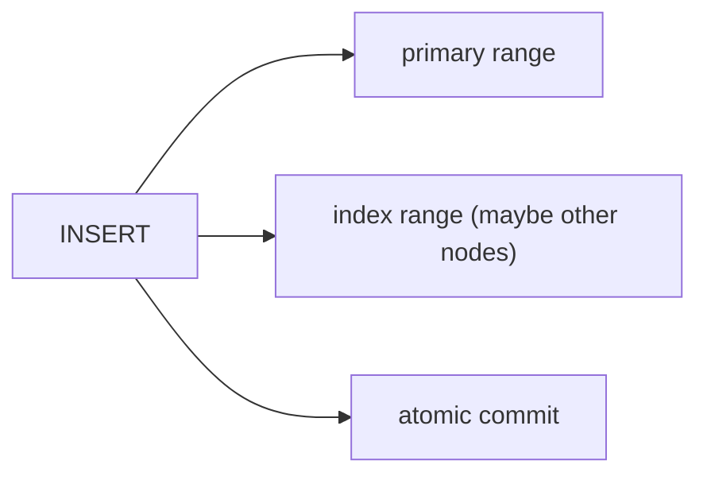
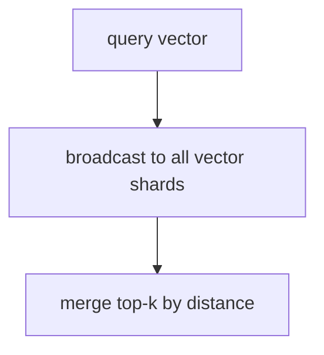
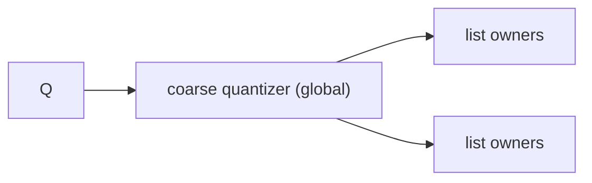
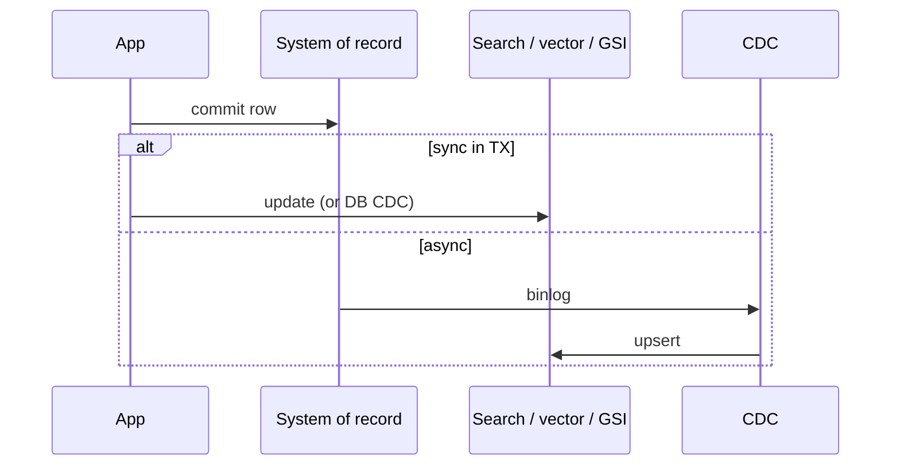
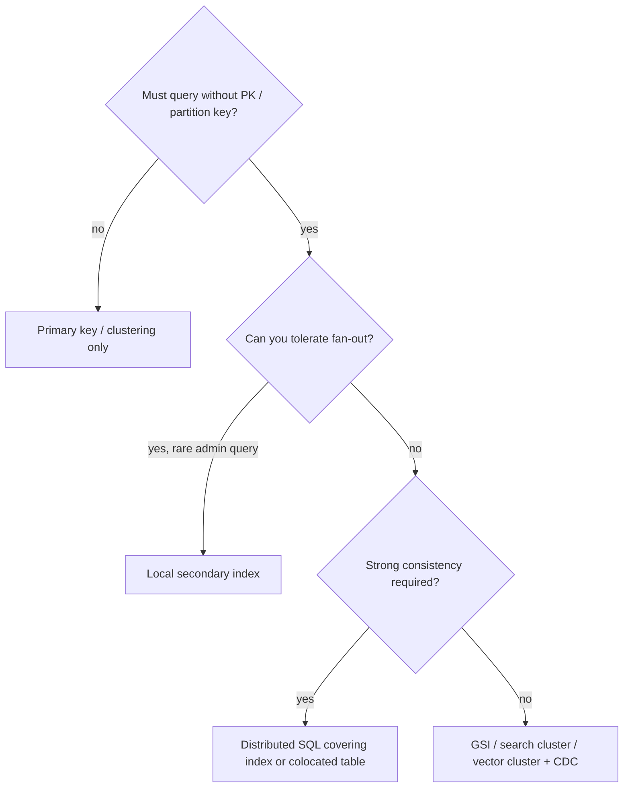

# 10 — Distributed and Secondary Indexes at Scale

Sharded SQL, DynamoDB, Cassandra, Elasticsearch, Pinecone, Cockroach. The question is **where the index lives relative to the data**, and **how many nodes a query must touch**.

---

## 1. The two families

| | Local (LSI / 2i local) | Global (GSI / materialized) |
|--|------------------------|-----------------------------|
| Write | Cheap, same shard as row | Extra distributed write |
| Read by secondary | Fan-out | Targeted |
| Consistency | Often same TX as row | Often eventual |
| Hot key | Follows base table | Can hot-spot on a popular secondary value (`status=open`) |

---

## 2. Scatter-gather cost

p99 = **slowest shard** + merge. Unbounded scatter is the silent killer of “we added an index.”

Mitigations: routing key in the query, global index, search cluster with fewer larger shards, cache.

---

## 3. DynamoDB LSI vs GSI (canonical example)

- **LSI:** `Query` still requires `user`. Different sort. Strong consistency. Size limit per partition.
- **GSI:** `Query` by `email` without knowing `user`. Eventual. Own throughput. Sparse by omitting attributes.

**Projection:** `KEYS_ONLY` vs `INCLUDE` vs `ALL` — covering vs write/storage cost. Same covering idea as SQL `INCLUDE`.

---

## 4. Cassandra: 2i vs materialized views vs extra tables

Team default at scale: **explicit extra tables** (dual write in batch/logged batch) so the partition key is obvious.

**SASI:** SSTable-attached secondary index — more expressive, still local, still scatter.

---

## 5. Distributed SQL secondary indexes

Cockroach / Yugabyte / Spanner:

- Index is a **second table** of ranges, Raft-replicated.
- Insert = write to table ranges + index ranges (possibly **distributed transaction**).
- **Storing / covering** columns avoid a second round trip to the primary.

**Interleave / colocate** child rows with parent: index + data locality for `customer → orders`.

Spanner **interleaving** + **index interleaved** options: design for locality or accept extra hops.

---

## 6. Elasticsearch: the index *is* the shard set

There is no separate “base table.” Routing (`_id` or custom) decides the shard. Secondary access = **another field in the same Lucene index** (or another index / alias).

**Cross-cluster search:** scatter-gather across clusters. Same merge issues.

**CCR (cross-cluster replication):** read locality vs lag — a **geo index strategy**.

---

## 7. Vector indexes when sharded

ANN **does not compose perfectly**:

- Independent HNSW per shard → merge k from each → not the same as global HNSW.
- More shards → more recall distortion **or** you over-fetch.
- **Partition by tenant** so queries don’t broadcast (also helps ACL).

Some systems use **distributed IVF**: centroids global, lists on nodes — query contacts `nprobe` nodes, not all.

---

## 8. Consistency and dual-write

| Mode | Use |
|------|-----|
| Same commit (distributed SQL index) | Strong, higher write latency |
| GSI internal replication | Eventual seconds or less |
| CDC to ES/Pinecone | Lag SLO; need version numbers to drop stale |
| Outbox table | Exactly-once-ish indexing |

**Read-your-writes:** after a user saves a doc, search may miss it. Product fix: bypass to primary, or wait for refresh, or session token “search after ts”.

**Deletes / ACL:** stale vectors are a **security** bug, not just relevance. Prefer version filters + explicit deletes.

---

## 9. Rebalancing and index rebuilds

- Hash rings: indexes must move with data or be rebuilt.
- Lucene: new shards empty until reindex.
- HNSW: splitting a shard ≠ splitting a graph cheaply; often **reindex**.
- Online `CREATE INDEX` on a live sharded cluster: per-range jobs, write traffic doubling.

---

## 10. Hot partitions (index edition)

Secondary value `country=US` or `status=active` as **GSI partition key** concentrates writes.

Fix: **salt / shard into the key** `(status, random_0_15)`, query 16 partitions in parallel (bounded scatter). Or don’t use that attribute as partition key; filter after a better key.

---

## 11. Multi-region

| Strategy | Index implication |
|----------|-------------------|
| Followers read | Local replica of same indexes; lag |
| Active-active | Conflict on indexed fields; CRDT or LWW |
| Pin tenant to region | Indexes never scatter globally |
| Search in one region | Extra hop for other geos |

---

## 12. Decision flowchart

---

## 13. Checklist

1. Name the **access key** for every query; if it isn’t the partition key, you are in this document.
2. Prefer **bounded** scatter (tenant routing, salted keys) over all-to-all.
3. Put an SLO on **index lag** for async search/vector.
4. Project/cover to avoid fetch storms after index hits.
5. Load-test the **GSI hot value**, not only the base table PK.
6. Treat rebuild/rebalance of ANN and Lucene as **first-class** ops, not afterthoughts.
