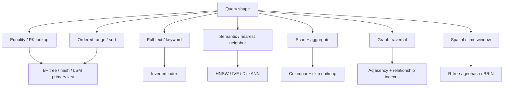

# Indexing Strategies

An **index** is an auxiliary data structure that trades **write cost, memory, and operational complexity** for **faster lookup, range scan, ranking, or nearest-neighbor search**. The same idea shows up everywhere: B-trees in Postgres, inverted lists in Lucene, LSM sparse indexes in Cassandra, HNSW graphs in vector DBs, and hybrid indexes in RAG pipelines.

This folder is organized by **area**, not by vendor. Each note covers the structures, query shapes they serve, write/read trade-offs, and how production systems actually use them.

## How to read

| # | File | Area |
|---|------|------|
| 01 | [01-fundamentals.md](./01-fundamentals.md) | What an index is, selectivity, covering, cost model |
| 02 | [02-relational-oltp.md](./02-relational-oltp.md) | SQL OLTP: B+ trees, hash, clustered vs heap, composites |
| 03 | [03-document-stores.md](./03-document-stores.md) | MongoDB / Couch / JSON: multikey, wildcard, text |
| 04 | [04-lsm-kv-wide-column.md](./04-lsm-kv-wide-column.md) | RocksDB, Cassandra, DynamoDB: LSM, bloom, sparse |
| 05 | [05-search-inverted-index.md](./05-search-inverted-index.md) | Lucene / ES / Solr: inverted index, BM25, postings |
| 06 | [06-vector-rag.md](./06-vector-rag.md) | ANN indexes, hybrid RAG, chunking, metadata filters |
| 07 | [07-columnar-olap.md](./07-columnar-olap.md) | ClickHouse, Parquet, warehouses: skip, bitmap, zone maps |
| 08 | [08-graph.md](./08-graph.md) | Property graphs, adjacency, Neo4j / Neptune indexes |
| 09 | [09-timeseries-spatial.md](./09-timeseries-spatial.md) | Time-series TSM/BRIN, R-trees, geohash, S2 |
| 10 | [10-distributed-indexes.md](./10-distributed-indexes.md) | Shard-local vs global, GSI/LSI, consistency |

## One picture of the landscape

## Decision cheat sheet

| You need… | First structure to think about |
|-----------|--------------------------------|
| `WHERE id = ?` millions of times | Clustered PK / hash / LSM key |
| `WHERE user_id = ? ORDER BY created_at` | Composite B-tree (leftmost prefix) |
| `WHERE status IN (...)` low cardinality | Bitmap (OLAP) or partial B-tree (OLTP) |
| Keyword search, ranking, facets | Inverted index |
| “Find docs like this paragraph” | Dense vector ANN + optional BM25 hybrid |
| `SUM(amount) GROUP BY day` over billions of rows | Columnar + zone maps / projections |
| Friends-of-friends / path queries | Adjacency lists, not a join of huge B-trees |
| `WHERE ts BETWEEN … AND geo DWITHIN` | Time partition + spatial index (or geohash prefix) |
| Secondary lookup on a sharded KV store | Local secondary index or GSI (know the fan-out) |

## Universal costs (every area)

1. **Write amplification** — every insert/update/delete must maintain each index.
2. **Storage amplification** — indexes often rival or exceed table size.
3. **Staleness vs consistency** — search, vector, and global secondary indexes are often **eventually consistent**.
4. **Choose indexes from queries**, not from columns. An unused index is pure tax.
5. **Hot partitions** — a “good” index can still melt one shard if the access key is skewed.

## Related in this repo

- Database basics: `concepts/system-design/database/`
- Caching (orthogonal to indexing): `concepts/system-design/cachingStrategies/`
- RAG in a chat stack: `concepts/ai/ai-system-design/ChatInterface/05-prompt-context-assembly.md`
