# DS & Algo problem-solving decision tree

Use this as a **pattern router**, not a rigid script. Most problems mix patterns; start from **constraints** and **what you must optimize**, then narrow candidates.

---

## 1. First pass: lock the problem shape

Answer these before picking an algorithm family.

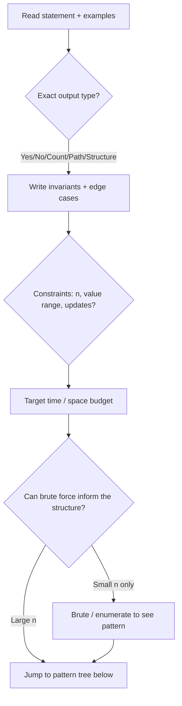

**Quick constraint cheat sheet**

| Typical `n` | Roughly feasible |
|-------------|------------------|
| ≤ 10–12 | Factorial / permutations, bitmask over subsets |
| ≤ 20–22 | `O(2^n)` with pruning |
| ≤ 10² | `O(n³)` sometimes |
| ≤ 10³–10⁴ | `O(n²)` or `O(n log n)` |
| ≤ 10⁵–10⁶ | `O(n)` or `O(n log n)` |
| ≥ 10⁶ | Usually `O(n)` or near-linear; heavy preprocessing only if queries amortize |

---

## 2. Master pattern router (high level)

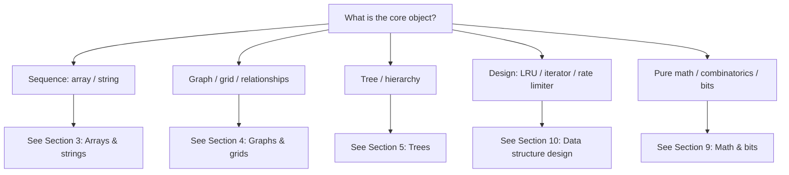

---

## 3. Arrays, strings, and substructures

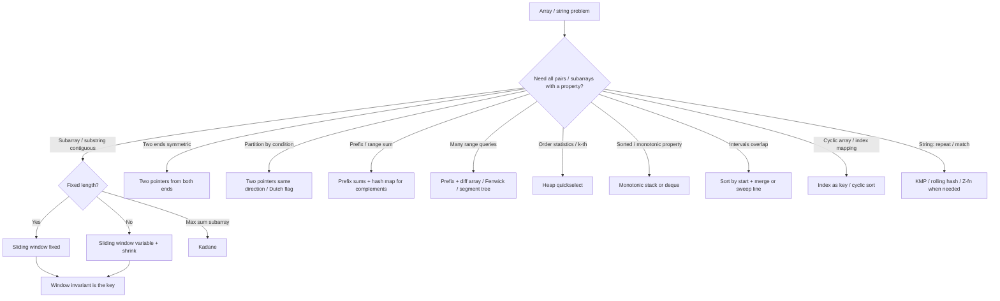

**Pattern notes (when to reach)**

- **Sliding window**: contiguous segment, optimize sum/count/distinctness with `O(n)`.
- **Two pointers**: sorted data, palindrome-like, pair with target, partition in one pass.
- **Prefix sum + map**: subarray sum = `k`, count of sums divisible by `k`, “number of …”.
- **Monotonic stack**: next greater/smaller, histogram largest rectangle, trap rain water.
- **Monotonic deque**: sliding window min/max.
- **Binary search on answer**: “minimize maximum”, “maximize minimum”, feasibility check monotonic.

---

## 4. Graphs, grids, and connectivity

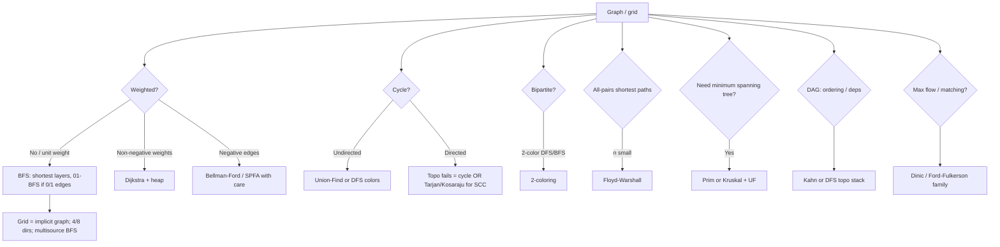

**Grid shortcuts**

- **Multi-source BFS**: distance to nearest 0, rotting oranges.
- **0–1 BFS**: binary weights on edges.
- **Flood fill / DFS**: islands, painting, connected components.
- **State graph**: position + extra state (keys, bitmask) → BFS/shortest path.

---

## 5. Trees (binary and N-ary)

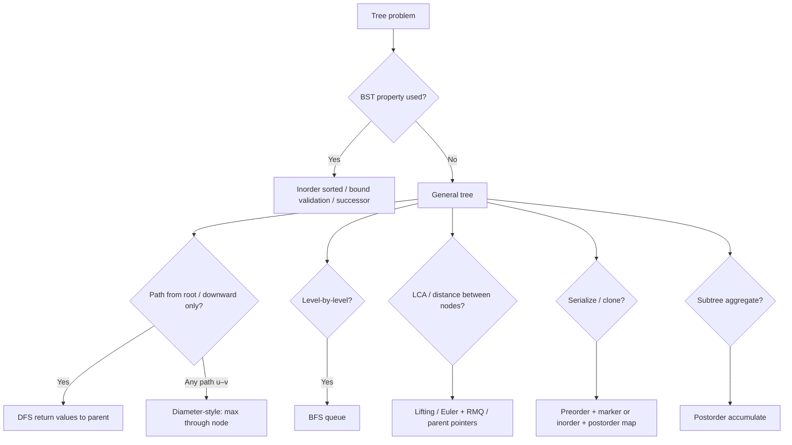

---

## 6. Dynamic programming (when recursion repeats subproblems)

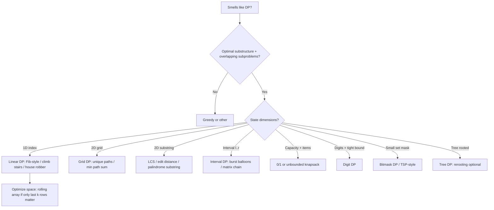

**Recognition hooks**

- **“Number of ways”** → often DP or combinatorics with modulus.
- **“Minimum / maximum”** with choices → DP or greedy after proof.
- **LIS**: `O(n log n)` patience sorting / binary search on tails.
- **Knapsack**: bounded variants → binary lifting on items or monotone queue optimization (advanced).

---

## 7. Backtracking and combinatorial search

```mermaid
flowchart TD
  BK[Generate / count arrangements] --> S{Structure}
  S --> SUB[Subsets: include / exclude]
  S --> PERM[Permutations: swap or used[]]
  S --> COMB[Combinations: start index to avoid duplicates]
  S --> BOARD[N-Queens / Sudoku: prune aggressively]

  SUB --> DUP{Duplicates in input?}
  DUP -->|Yes| SORT[Sort + skip equal neighbors]
```

Use when `n` is small and constraints are **logical** (sudoku rules), not when a closed form or DP exists.

---

## 8. Binary search (not only on sorted arrays)

```mermaid
flowchart TD
  BS[Binary search entry] --> A{Classic sorted array?}
  A -->|Yes| SA[Lower/upper bound / rotated split / peak]
  A -->|No| ANS[Search on answer space]

  ANS --> MONO{Feasible(x) monotone?}
  MONO -->|Yes| MINMAX[Minimize max / maximize min templates]
  MONO -->|No| REFINE[Reformulate or different approach]

  SA --> ROT[Compare mid with end for pivot]
```

**On-answer checklist**

1. Define `check(x)` (can we achieve requirement with threshold `x`?).
2. Prove monotonicity: if `x` works, does `x+1` work (or the dual)?
3. Pick `lo, hi` carefully (inclusive vs exclusive bounds).

---

## 9. Heaps, order statistics, and scheduling

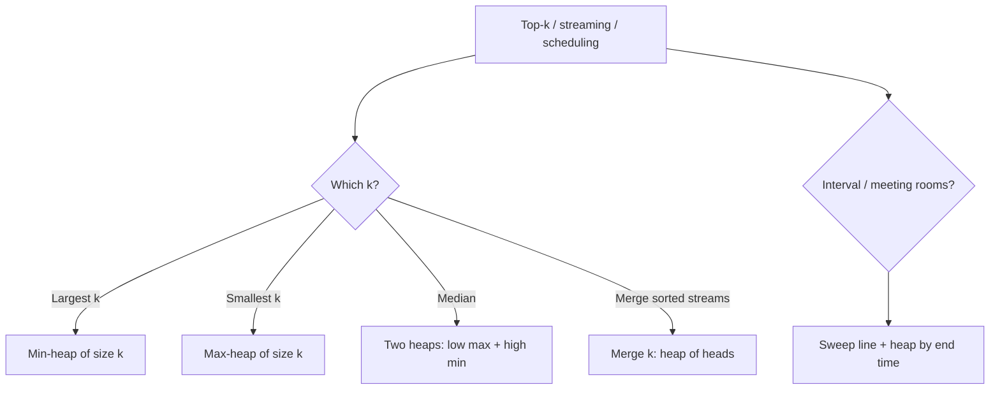

---

## 10. Data structure design & heavy queries

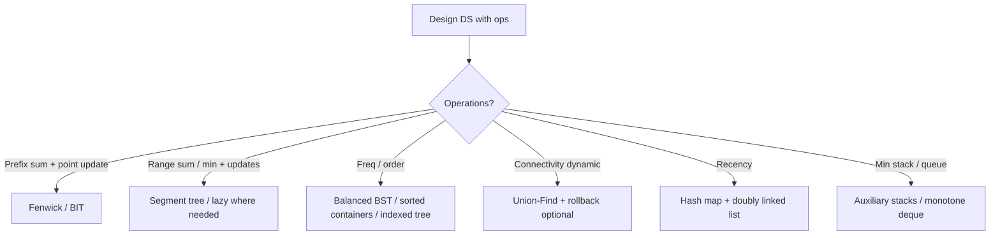

---

## 11. Math, number theory, and bit tricks

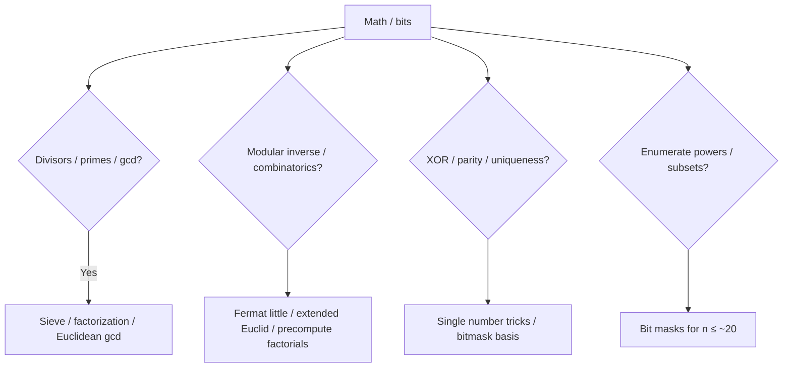

---

## 12. Strings (beyond two pointers)

| Symptom | Pattern |
|--------|---------|
| Repeated pattern / substring search | KMP, Z-function, rolling hash |
| Many queries on same text | Suffix array / automaton (advanced) |
| Palindrome centers | Expand around center, Manacher (linear palindrome) |
| Lexicographic rank | Factorial numbering / combinatorics |

---

## 13. Trie and prefix structures

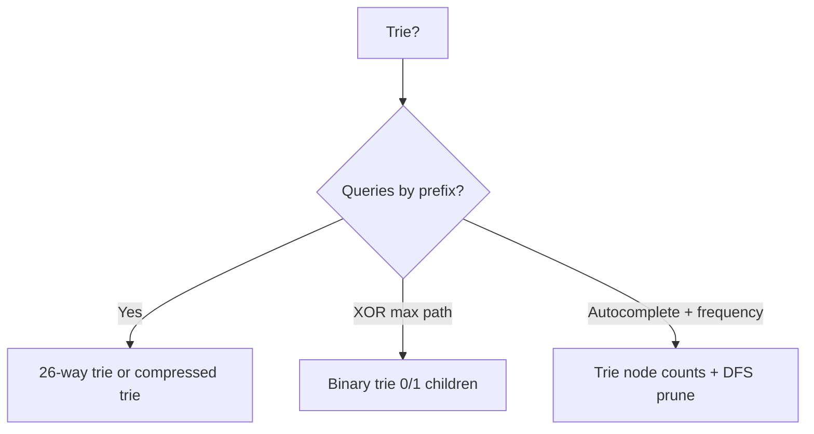

---

## 14. Greedy (only after a proof sketch)

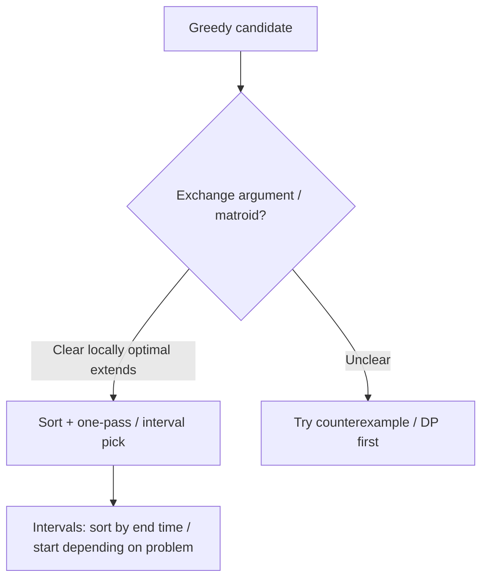

If a simple counterexample breaks the greedy step, switch to DP or exhaustive search for small `n`.

---

## 15. Endgame: verify before you code

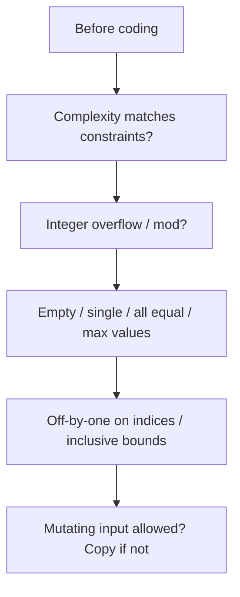

---

## 16. Pattern → template map (exhaustive checklist)

Use as a **coverage list**; tick what applies, then combine.

**Linear structures**

- [ ] Two pointers (opposite / same direction)
- [ ] Sliding window (fixed / variable)
- [ ] Prefix / suffix sums, difference array
- [ ] Hash map / set (frequency, complement, dedupe)
- [ ] Sorting + custom comparator / coordinate compression
- [ ] Monotonic stack / deque
- [ ] Binary search (array / on answer)
- [ ] Quickselect / nth element
- [ ] Merge intervals / sweep line
- [ ] Cyclic sort / “each index owns a value” tricks

**Linked structures**

- [ ] Fast and slow pointers (cycle, middle, k-from-end)
- [ ] Dummy node for edge cases
- [ ] In-place reversal (iterative / recursive)

**Trees**

- [ ] DFS (pre / in / post), return info to parent
- [ ] BFS level order
- [ ] BST invariants, successor / predecessor
- [ ] LCA (binary lifting / parent map / Euler tour)
- [ ] Serialization / deserialization

**Graphs**

- [ ] BFS / multi-source BFS / 0–1 BFS
- [ ] Dijkstra
- [ ] Bellman-Ford (negative edges)
- [ ] Floyd-Warshall (small `n`, all pairs)
- [ ] Topo sort (Kahn / DFS)
- [ ] Union-Find (components, Kruskal)
- [ ] Bipartite check
- [ ] SCC (Tarjan / Kosaraju)
- [ ] MST (Prim / Kruskal)
- [ ] Max flow / matching (when “assignment” is network flow)

**Dynamic programming & search**

- [ ] Linear / grid / interval / digit / bitmask / tree DP
- [ ] Knapsack variants
- [ ] Backtracking with pruning
- [ ] Meet-in-the-middle (split array in half, `~2^(n/2)`)

**Advanced / contest-adjacent**

- [ ] Segment tree / Fenwick
- [ ] Trie / binary trie
- [ ] Sparse table (RMQ static)
- [ ] Line sweep with heap
- [ ] String algorithms (KMP, hashing, Manacher)

---

## 17. How to combine patterns (real problems)

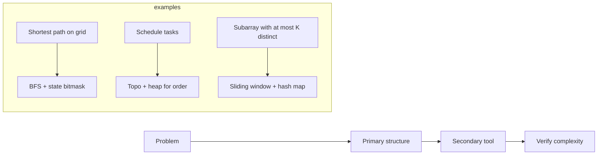

Typical stacks: **graph + heap** (Dijkstra), **topo + priority** (course schedule III style), **binary search + greedy check**, **DFS + memo** (grid DP), **union-find + Kruskal**.

---

## 18. Suggested drill order (optional)

1. Arrays: two pointers, sliding window, prefix sums.
2. Binary search: sorted variants + on answer.
3. Trees: traversal + BST + path problems.
4. Graphs: BFS, DFS, topo, Dijkstra, UF.
5. DP: linear → grid → knapsack → interval.
6. Heaps, trie, segment tree / BIT as needed for gaps.

---

*This file is a living map: add links to your own solutions under `leetcode/` or `graph/` when a pattern clicks.*
