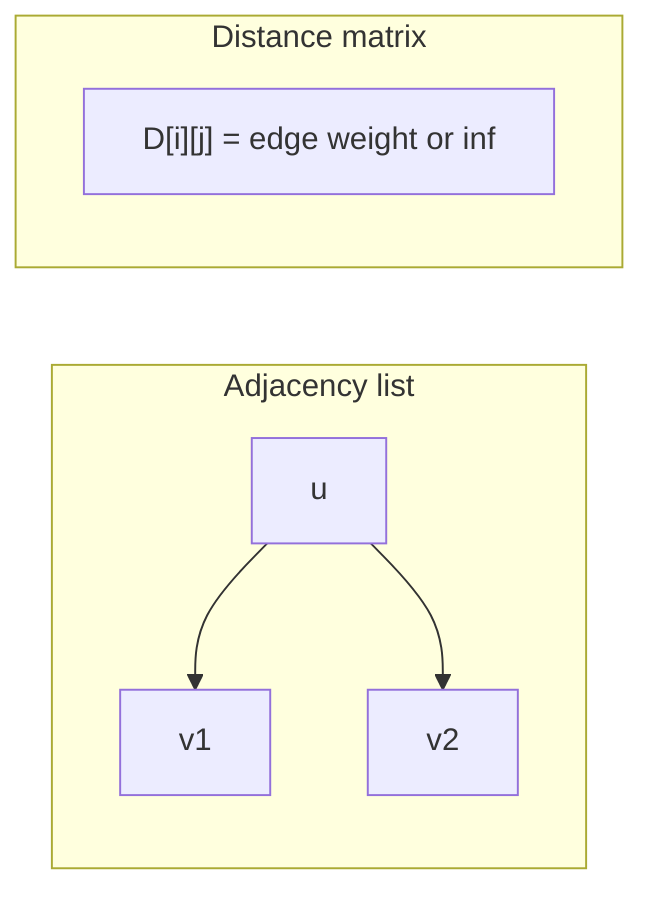
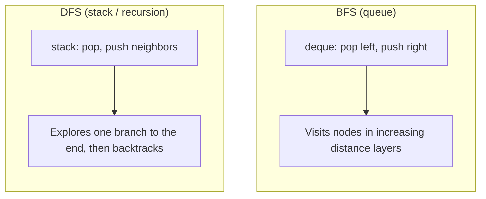
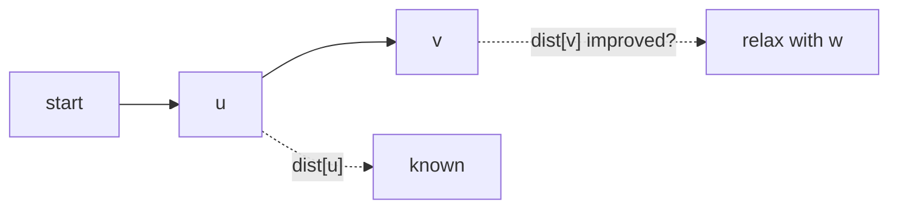
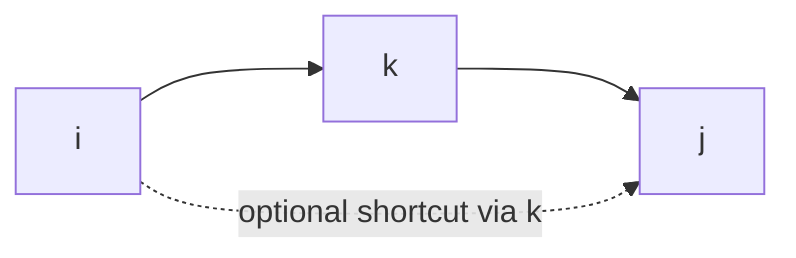
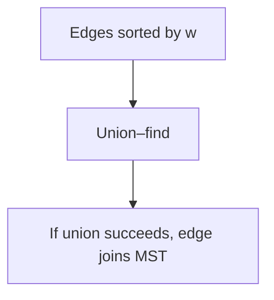
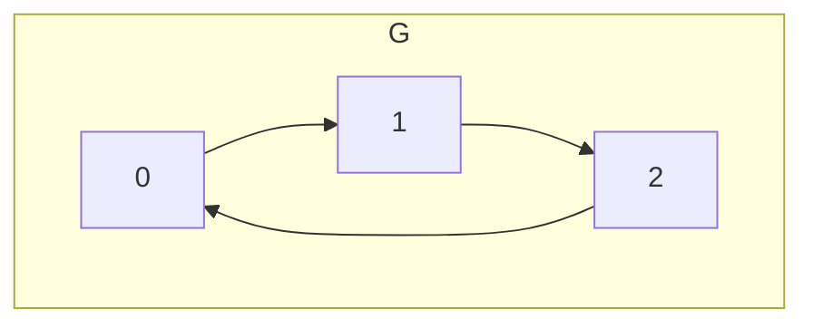

# Graph algorithms (reference)

This folder collects small, readable Python templates for common graph problems. Vertices are integers `0 .. n - 1` unless noted. **Imports are written so modules resolve each other when loaded from this directory** (for example, run scripts or tests with the working directory set to `ds-algo/graph`, or ensure this folder is on `PYTHONPATH`).

## Representations

| Idea | Shape | Typical use |
|------|--------|-------------|
| Unweighted adjacency list | `adj[u] -> [v, ...]` | BFS, DFS, topo, SCC, bipartite checks |
| Weighted adjacency list | `adj[u] -> [(v, w), ...]` | Dijkstra, Prim |
| Edge list | `(u, v, w)` | Bellman–Ford, Kruskal, building matrices |
| Distance matrix | `n × n`, `inf` off-diagonal | Floyd–Warshall |

## File map

| File | What it does |
|------|----------------|
| [bfs.py](bfs.py) | Breadth-first traversal (queue) |
| [dfs.py](dfs.py) | Depth-first traversal (recursion + explicit stack) |
| [dijkstra.py](dijkstra.py) | Single-source shortest paths, **non-negative** weights |
| [bellman_ford.py](bellman_ford.py) | Single-source shortest paths; **negative** edges; detects negative cycles |
| [floyd_warshall.py](floyd_warshall.py) | All-pairs shortest paths (dynamic programming over intermediate vertices) |
| [union_find.py](union_find.py) | Disjoint-set (union–find) for Kruskal |
| [kruskal.py](kruskal.py) | Minimum spanning **forest** (sort edges + union–find) |
| [prim.py](prim.py) | Minimum spanning **forest** (grow tree with a priority queue) |
| [topological_sort.py](topological_sort.py) | Topological order (Kahn BFS + DFS coloring) |
| [strongly_connected_components.py](strongly_connected_components.py) | SCCs via **Kosaraju** (two DFS passes) |
| [bipartite.py](bipartite.py) | 2-coloring / bipartite test (BFS) |
| [cycle_in_an_undirected_graph.py](cycle_in_an_undirected_graph.py) | Cycle detection (DFS / BFS templates) |

---

## Traversal: BFS and DFS

- **BFS** explores layer by layer using a queue. On an **unweighted** graph, the first time you reach a node is along a **shortest path** in edge count from the start.
- **DFS** goes deep before backtracking; useful for connectivity, cycle detection in directed graphs (with colors), and as a building block for SCC and topological sort.

---

## Shortest paths

### Dijkstra ([dijkstra.py](dijkstra.py))

**When:** Non-negative edge weights. **Idea:** Maintain `dist[u]` = best known distance from `start`. Pop the unsettled node with **smallest** tentative distance (min-heap); **relax** each outgoing edge `(u, v, w)`:

If `dist[u] + w < dist[v]`, set `dist[v] = dist[u] + w`.

**Why a heap:** Selecting the minimum `dist` mimics expanding a “wavefront” of shortest paths. **Why not negative edges:** A long “cheap” prefix could later become invalid after a negative relaxation; the greedy order breaks.

**Complexity:** `O((V + E) log V)` with a binary heap.

### Bellman–Ford ([bellman_ford.py](bellman_ford.py))

**When:** Weights may be negative; you need **negative-cycle detection** reachable from the source. **Idea:** Repeat `V - 1` rounds of relaxing **all** edges. If any edge still improves `dist` after that, a negative cycle exists.

**Complexity:** `O(V · E)`.

### Floyd–Warshall ([floyd_warshall.py](floyd_warshall.py))

**When:** You need **all pairs** `i → j` distances in a dense or small graph. **Idea:** Allow paths to use intermediate vertices from `{0..k}` only, for `k = 0 .. n-1`:

`D[i][j] = min(D[i][j], D[i][k] + D[k][j])`.

**Complexity:** `O(V³)` time, `O(V²)` space. Use `make_dist_matrix` to build `D` from an edge list before running `floyd_warshall`.

---

## Minimum spanning tree

Both [kruskal.py](kruskal.py) and [prim.py](prim.py) compute a **minimum spanning forest** (one MST per connected component).

### Kruskal

Sort edges by weight; add an edge if it connects two different components (`UnionFind`).

**Complexity:** `O(E log E)` for sorting, nearly `O(E α(V))` for unions.

### Prim

Start from an arbitrary root in a component; repeatedly attach the **cheapest** edge from the growing tree to a vertex **outside** (priority queue).

**Complexity:** `O(E log V)` with a binary heap.

---

## Directed acyclic graphs: topological sort ([topological_sort.py](topological_sort.py))

**Topological order:** Vertices ordered so every edge `u → v` has `u` before `v`. **Exists iff** the graph is a **DAG** (no directed cycles).

- **Kahn:** Repeatedly remove vertices with indegree `0` (BFS on indegrees).
- **DFS:** Mark `GRAY` while exploring; back edge to `GRAY` means a cycle. Collect **finish** order and reverse.

Valid orders include `A, B, C` (among others if there are parallel branches).

---

## Strongly connected components ([strongly_connected_components.py](strongly_connected_components.py))

In a **directed** graph, an SCC is a maximal set of mutually reachable vertices.

**Kosaraju:** (1) DFS on `G`, record vertices in **finish** order. (2) DFS on the **reversed** graph in **reverse** finish order; each DFS tree is one SCC.

Here `{0,1,2}` is one SCC.

---

## Bipartite graphs ([bipartite.py](bipartite.py))

**Bipartite** iff vertices can be 2-colored so every edge joins different colors. **BFS** (or DFS): try to color neighbors with the opposite color; a monochromatic edge means **not** bipartite (odd cycle).

---

## Union–find ([union_find.py](union_find.py))

Supports `find` (representative) and `union` with **path compression** and **union by rank** so amortized time per operation is nearly constant (`α(n)` inverse Ackermann).

---

## Quick complexity reference

| Algorithm | Time | Notes |
|-----------|------|--------|
| BFS / DFS | `O(V + E)` | Adjacency list |
| Dijkstra | `O((V+E) log V)` | Binary heap; non-negative `w` |
| Bellman–Ford | `O(V · E)` | Negative edges; detects neg cycles |
| Floyd–Warshall | `O(V³)` | All-pairs |
| Kruskal | `O(E log E)` | Sort dominates |
| Prim | `O(E log V)` | Binary heap |
| Topological sort | `O(V + E)` | Kahn or DFS |
| Kosaraju | `O(V + E)` | Two DFS passes |
| Bipartite BFS | `O(V + E)` | |

---

## Related notes

- [study.md](study.md) — brief BFS/DFS notes and complexity sketches.
- For **single-pair** shortest path on large sparse graphs with non-negative weights, A-star search (not implemented here) is Dijkstra with a heuristic—useful in grids and games.
