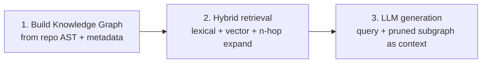
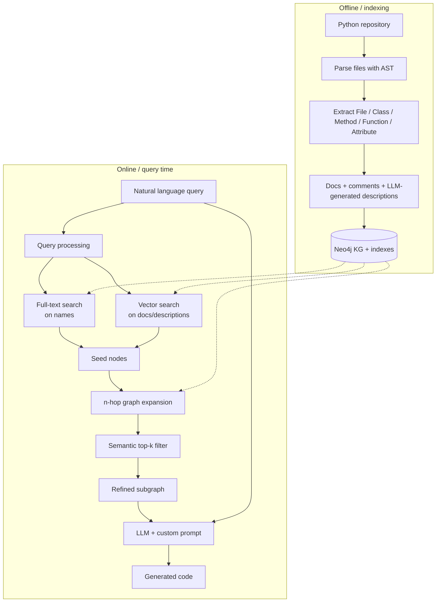
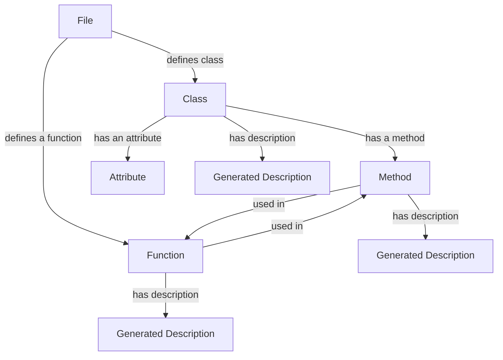
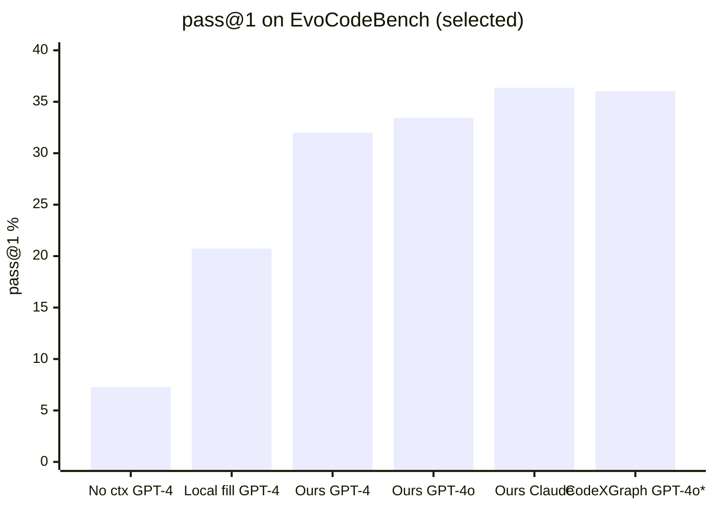

# Notes: Knowledge Graph Based Repository-Level Code Generation

**Paper:** [arXiv:2505.14394v1](https://arxiv.org/abs/2505.14394)  
**Authors:** Mihir Athale, Vishal Vaddina (Quantiphi / Northeastern)  
**Local copies:** `2505.14394v1.pdf`, `paper.html`, `paper.md`

---

## One-sentence takeaway

Turn a code repo into a **knowledge graph**, retrieve a **relevant subgraph** (hybrid lexical + semantic + graph hops), and feed that subgraph to an LLM so generated code fits the repo’s structure, dependencies, and style — not just “code that compiles in isolation.”

---

## Problem statement

LLMs are strong at standalone coding (HumanEval-style), but weak at **repository-level** work:

| Failure mode | What goes wrong |
|---|---|
| No project context | Misses architecture, patterns, internal APIs |
| Redundancy | Reimplements helpers that already exist |
| Style drift | Naming, patterns, conventions don’t match the repo |
| Weak retrieval | Classic RAG / BM25 / “similar code” miss multi-file dependency chains |

**Goal:** better *retrieval of context* → better *generation that integrates*.

---

## Big picture: 3 stages





---

## Stage 1 — Knowledge graph construction

### What gets extracted

From each file via AST:

- Classes \(C_i\), Methods \(M_i\), Functions \(F_i\), Attributes \(A_i\), plus vars/deps

### Schema (conceptual)

**Node types \(V\):** File, Class, Method, Function, Attribute, Generated Description  

**Relation types \(R\):** defines class, defines a function, has a method, used in, has an attribute, has description



### Extra metadata (why it matters)

1. **Human docs/comments** → good for lexical/semantic search  
2. **LLM-generated functional descriptions** → capture *what code does* even when docs are thin  
3. Embeddings via **all-MiniLM** → stored as **vector indexes** in Neo4j  

### Indexes in Neo4j

| Index type | Over |
|---|---|
| Full-text | function / class / method / module names |
| Vector | documentation + LLM-generated descriptions |

**Intuition:** names catch “call `UserService`”; vectors catch “authenticate the user from a JWT.”

---

## Stage 2 — Hybrid code retrieval (the core idea)

Not just “embed query → nearest chunks.” Three signals + expand + prune.

```mermaid
sequenceDiagram
  participant U as User
  participant LLM as LLM (entity extract)
  participant Enc as Encoder (MiniLM)
  participant FT as Full-text index
  participant Vec as Vector index
  participant G as Neo4j graph
  participant Gen as Code LLM

  U->>LLM: NL query + schema
  LLM-->>U: entities (classes, fns, …)
  U->>Enc: same query
  Enc-->>U: query embedding

  U->>FT: search entity names
  FT-->>U: name-matched nodes
  U->>Vec: similarity on docs/descriptions
  Vec-->>U: semantically related nodes
  Note over U: Reverse-map description nodes → code nodes; keep top-k

  U->>G: n-hop traversal from seed nodes
  G-->>U: expanded subgraph (deps + usages)
  U->>Enc: embed subgraph nodes
  Enc-->>U: similarity vs query
  Note over U: Keep top-k → pruned subgraph

  U->>Gen: query + pruned subgraph
  Gen-->>U: repo-aligned code
```

### Step-by-step

1. **Query processing**
   - LLM + schema → named entities in the query  
   - Encoder → query embedding  

2. **Initial retrieval**
   - Full-text on entity names  
   - Vector search on docs/descriptions → map back to code nodes  
   - Keep top‑k by score threshold  

3. **Expand (n-hop subgraph)**
   - From each seed, walk neighbors for **dependencies** and **usages**  
   - Hop count is a hyperparameter (richer context vs noise/latency)  

4. **Filter**
   - Embed nodes in the expanded subgraph  
   - Rank by similarity to the query  
   - Keep top‑k so the LLM isn’t flooded  

**Why hybrid wins (vs related work):**

| Approach | Strength | Weakness |
|---|---|---|
| RepoCoder | similar-code retrieval | needs lots of near-duplicates |
| RepoFusion / BM25 | multi-context fusion | scale / cost |
| GraphCoder (CCG) | statement-level structure | weak modular + semantic coverage |
| CodeXGraph | LLM → graph query | brittle on complex semantic queries |
| **This paper** | lexical + semantic + hops | subgraph expand/filter can be expensive |

---

## Stage 3 — Generation

- Prompt includes: user query + **subgraph** (snippets **and** edges/relations)  
- Instructions: reuse existing APIs, respect deps, match repo style  
- Output is meant to drop into the codebase with less manual cleanup  

---

## Evaluation setup (EvoCodeBench)

- **275** samples from **25** open-source Python repos  
- Task: generate the **body** of a given function/method (namespace, location, intended behavior, args known)  
- For eval they **simplify** the online pipeline:
  1. Replace target body with `pass`  
  2. Build KG for the repo  
  3. Take a **2-hop** subgraph from the **known target node** (no NL entity extraction needed)  
  4. LLM generates body → run dataset tests → **pass@1**

```mermaid
flowchart LR
  S[Sample: target fn/method] --> P[Body := pass]
  P --> KG[Build KG]
  KG --> H2[2-hop subgraph from target]
  H2 --> LLM[LLM generates body]
  LLM --> T[Run EvoCodeBench tests]
  T --> M[pass@1]
```

---

## Results (pass@1)

| Category | Method | Model | pass@1 |
|---|---|---|---|
| **Proposed** | Graph retrieval | Claude 3.5 Sonnet | **36.36%** |
| Proposed | Graph retrieval | GPT-4o | 33.45% |
| Proposed | Graph retrieval | GPT-4 | 32.00% |
| Baseline | Local file infilling | GPT-4 | 20.73% |
| Baseline | Local file completion | GPT-4 | 17.45% |
| Baseline | No context | GPT-4 | 7.27% |
| CodeXGraph* | Graph | GPT-4o | 36.02% |

\*CodeXGraph reported on **212/275** samples; this paper claims **all 275**.



**Reading the numbers:** context matters a lot (7% → ~21% with local file). Graph/repo structure pushes further (~32–36%). Absolute scores are still modest — repo-level generation is hard.

---

## Mental model: what the LLM sees

Without KG / hybrid retrieval:

```text
[query] + maybe same-file text
```

With this system:

```text
[query]
+ target-related functions/classes
+ who calls whom / what imports what
+ docs & LLM descriptions of those neighbors
(only the pruned top-k of an n-hop neighborhood)
```

So the model can answer: *which existing helpers to call, how this module is usually used, what types/attrs exist nearby.*

---

## Limitations & future work (from the paper)

- Subgraph expand + filter is **compute-heavy** on large repos; hop depth vs latency tradeoff  
- Schema could grow (decorators, types, non-code files)  
- Multi-language support  
- Agent loops: adaptive hop depth, iterative retrieval  
- Fine-tune LLMs to consume graph structure better  
- Same KG for debugging, docs, translation  

---

## Glossary

| Term | Meaning here |
|---|---|
| Repository-level generation | Code that must fit a real multi-file project, not a toy snippet |
| Knowledge graph (KG) | Typed nodes + relations over code entities |
| Hybrid retrieval | Full-text + vector + graph traversal |
| n-hop subgraph | Nodes within n edges of seeds (deps + usages) |
| pass@k | Fraction of tasks where ≥1 of k samples passes tests; they report pass@1 |
| EvoCodeBench | Evolving benchmark of real-repo function-body generation |

---

## How to re-read the paper efficiently

1. **Fig 1 / §I** — problem + 3-step story  
2. **§III-A** — schema + Neo4j indexes  
3. **§III-B** — hybrid retrieve → expand → filter (most important section)  
4. **§IV-B** — how eval differs from the full NL pipeline (2-hop from known target)  
5. **Table I / §V** — numbers vs baselines and CodeXGraph  
6. **§VI** — limits and next steps  

---

## Source files in this folder

| File | What it is |
|---|---|
| `2505.14394v1.pdf` | Official PDF |
| `paper.html` | ar5iv HTML |
| `paper.md` | Text extract of the HTML paper |
| `notes.md` | These study notes |
